This labs walks through different AI Visuals in Power BI

| Feature | Overview | 
|:------:|:---------:|
|[Key influencers](AIVisualLab.md#key-influencers)|The key influencers visual helps you understand the factors that drive a metric or attribute you're interested in|
|[Q & A](AIVisualLab.md#q&a)|The Q&A feature allows your end users to ask questions about your data in power bi using NLP|
|[Decomposition tree](AIVisualLab.md#decomposition-tree)|The decomposition tree visual in Power BI lets you visualize data across multiple dimensions|
|[Smart narrative](AIVisualLab.md#smart-narrative)|The smart narrative visualization helps you quickly summarize visuals and reports|
|[Anomaly detection](AIVisualLab.md#anomaly-detection)|Anomaly detection helps you enhance your line charts by automatically detecting anomalies in your time series data|

# Preparation

1. Download the [csv file](heroes_information.csv) (Open in a new window, right click, click **save as**)

2. Open Power BI Desktop, click **Get Data** on home tab, choose **Text/CSV** and choose the csv file downloaded in step 1, and click **open**, click **load**.

# Key Influencers

1. Do the [Preparation Step](AIVisualLab.md#preparation) if it has not been done already.

2. In the Visualizations pane, select a key influencer chart.

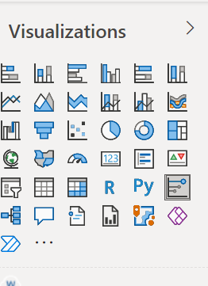

* With the key influencer chart visual selected:
* Drag the **Alignment** field to the Analyze.
* Drag the **Hair color** field to Explain by.
* Drag the **Gender** field to Explain by.
* Drag the **Eye color** field to Explain by.
* Drag the **Race** field to Explain by.
* Drag the **Skin color** field to Explain by.

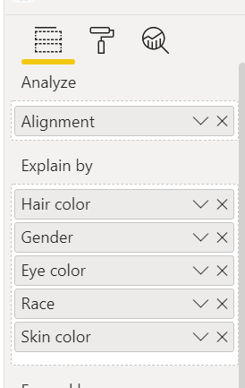

3. For **What influencers Alignment to be** Select the dropdown to be **bad** within the key influencer chart 

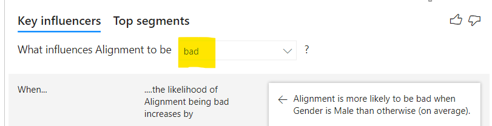

4. Click on different key influencers to explore the UI, also click on the checkbox **Only show values that are influencers** to see only key influencers. 
click on **top segments** tab and the bubbles to explore the UI for combination of Key influencers.

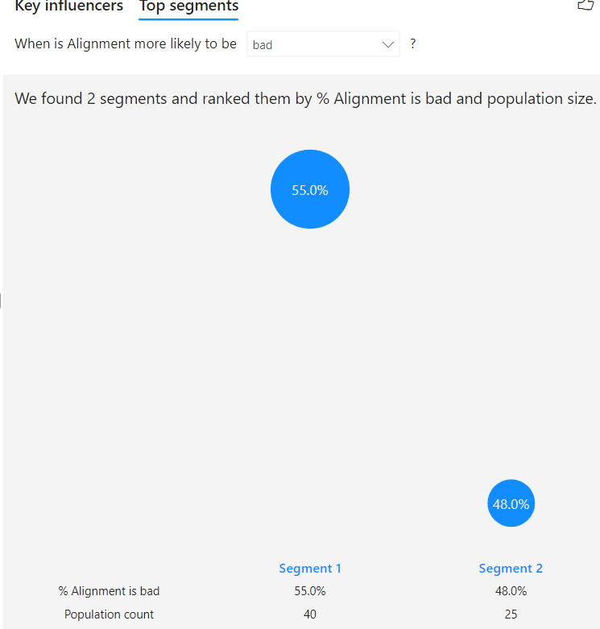

5. Copy Paste the key influencer visual, and put the new key influencer visual on the side to the original visual, for both visuals put, **publisher** in the filter pan for **filters on this visual**, for one visual, filter to "Marvel Comics" for **publisher** for the other, filter to "DC Comics" for **publisher**. With side-by-side visuals, you are able to see how key influencers different for different publisher.

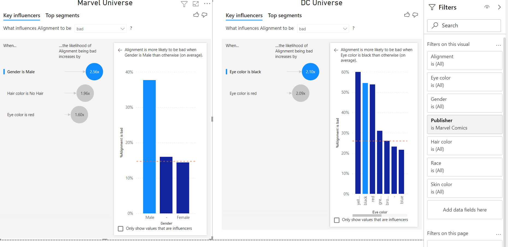

**Note**: For more details, please see [Key influencers](https://docs.microsoft.com/en-us/power-bi/visuals/power-bi-visualization-influencers) in Microsoft Doc.

# Q&A

1. Do the [Preparation Step](AIVisualLab.md#preparation) if it has not been done already.

2. In the Visualizations pane, select a Q&A chart.

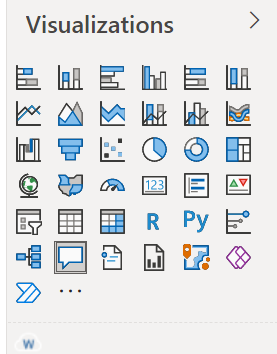

3. For **Ask a question about your data** type in **average height by race** and see the visual instantly render

4. Continue to type **as treemap** after the **average height by race**, and see the visual change

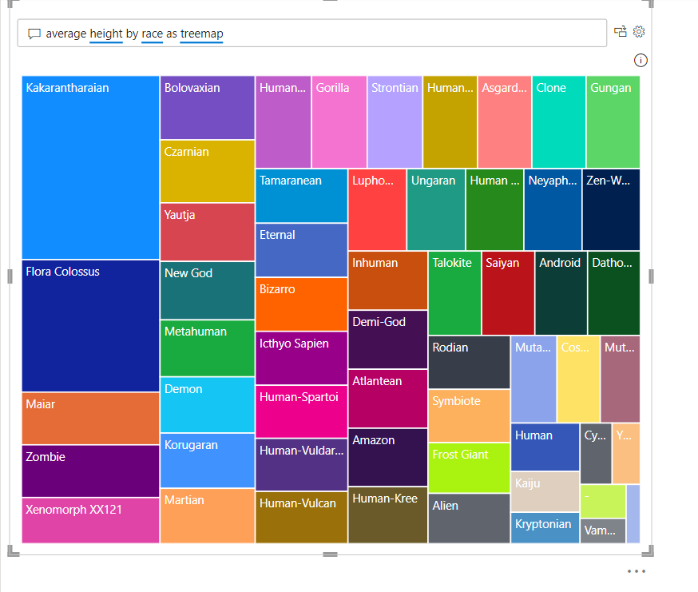

5. You can turn the Q&A rendered visual into a standard one by clicking below icon

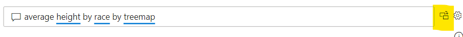

6. You can also manage the setting by clicking the gear icon

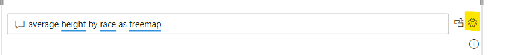

7. In **field synonyms** you can toggle on and off the tables/columns to include or exclude from Q&A and management synonyms. When a field in a different visual is renamed, the renamed field will show as suggested term in Q&A. 

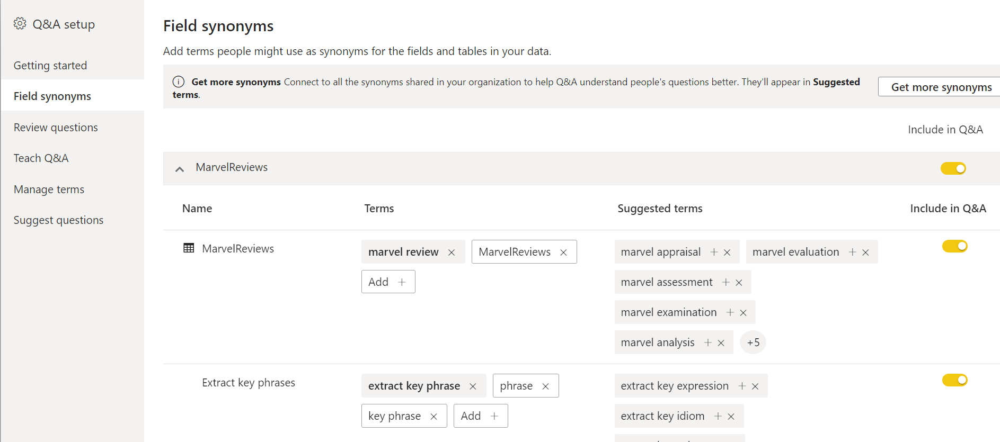

8. Close the **Q&A setup** window, click **publish** on the ribbon on home tab.(skip if you dont have power bi service access)

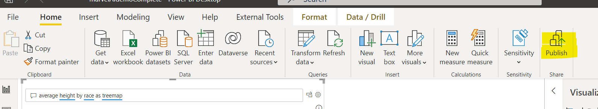

9. Choose the workspace you created in the [prerequisite](Prerequisite.md#provision-workspace), click **select**. You might be prompted to give your pbix a name and save it before publish you have not saved your pbix before.(skip if you dont have power bi service access)

10. After the report is published, you can go to the report by clicking **Open xxxx.pbix** in Power BI, or go to power bi workspace, and navigate to the report that you published.(skip if you dont have power bi service access)

11. In the published report, type in **average height by sex**, then type in **average height by universe**(skip if you dont have power bi service access)

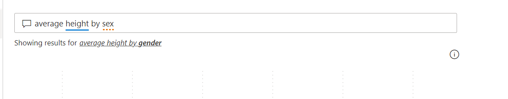

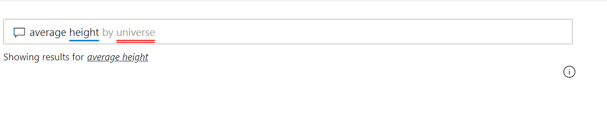

12. Click on **universe**, then click on **ask (your username) to add universe**(skip if you dont have power bi service access)

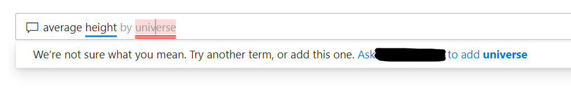

13. Go back to Power BI Desktop, click on the gear icon to open Q&A setting, you can review questions that end users have been asking in **review questions** tab. Click on **fix needed** next to the question **average height by universe**(skip if you dont have power bi service access)

**Note:** You do not need to be using the original pbix in order to review questions, you can also open a new pbix, click a Q&A visual, go to Q&A setting, and in **review questions**, click on **choose a different dataset** and choose the dataset that you just published.

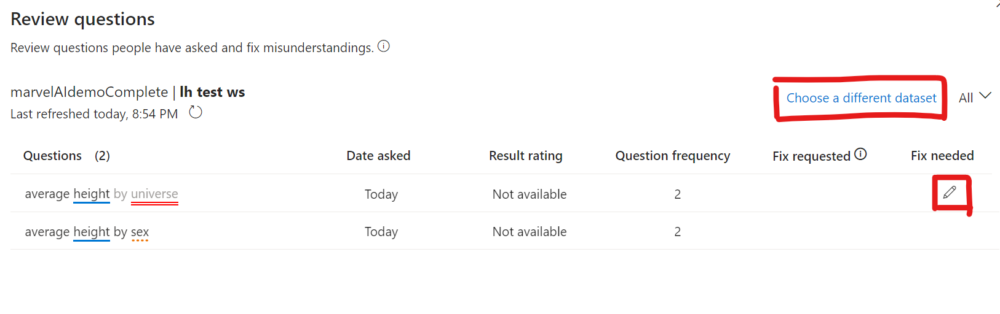

14. The window will go to **Teach Q&A** with the question that needs fixing, alternatively, you can submit a question manually.(skip if you dont have power bi service access)

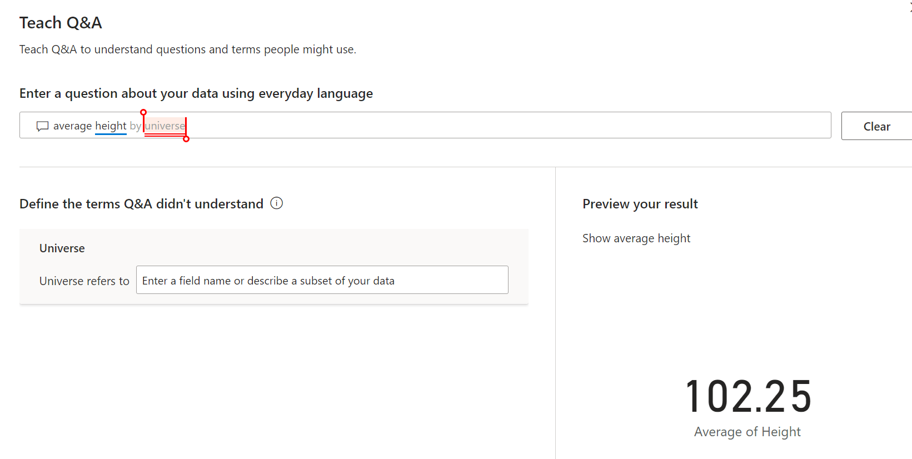

15. Type in **publisher** after **universe refers to** click **save**. Q&A will now understand what universe means in future questions.(skip if you dont have power bi service access)

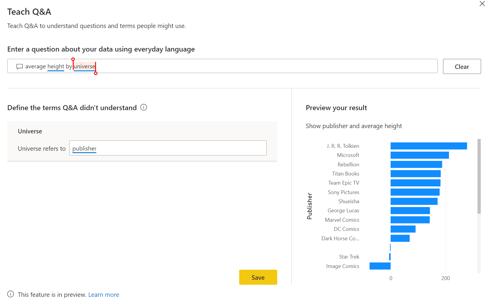

16. In **Suggest questions**, you can type in the questions that are frequently asked in **review questions** or questions you think could you relevant to your end users. suggested questions will show in the Q&A UI, and end users can click on them directly instead of typing in their own questions

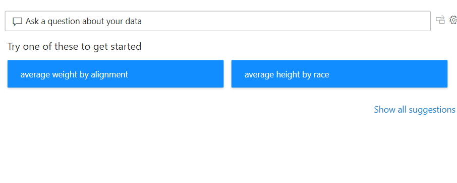

**Note:** For more details, please see [Q&A](https://docs.microsoft.com/en-us/power-bi/visuals/power-bi-visualization-q-and-a) in Microsoft Doc.

# Decomposition Tree

1. Do the [Preparation Step](AIVisualLab.md#preparation) if it has not been done already.

2. In the Visualizations pane, select a decomposition tree chart.

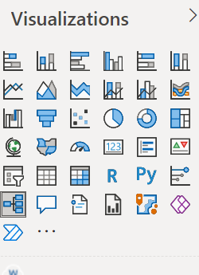

* With the decomposition tree chart visual selected:
* Drag the **Height** field to the Analyze.
* Click the dropdown next to **Height** in the Analyze, change it from **sum** to **average**.
* Drag the **Hair color** field to Explain by.
* Drag the **Gender** field to Explain by.
* Drag the **Eye color** field to Explain by.
* Drag the **Race** field to Explain by.
* Drag the **Weight** field to Explain by.
* Drag the **Publisher** field to Explain by.

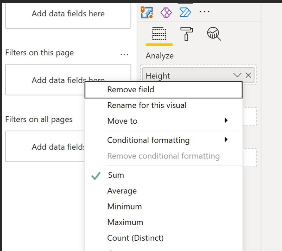

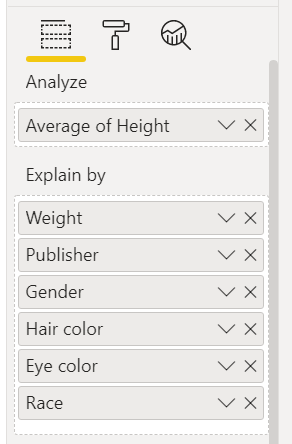

3. Click the "+" sign to select a dimension to expand the tree with, you can alternatively select **high value** or **low value**, this will let AI decide which dimension to expand the tree with next. AI will pick the dimension that is most important in driving the high/low value of what you have selected to analyze. If a dimension is selected by AI, there will a light bulb next to the name.

4. You can select to lock level, by clicking the lock icon next to the dimension name, if you do so, end users will not be able to ellapse the tree on and before this level. 

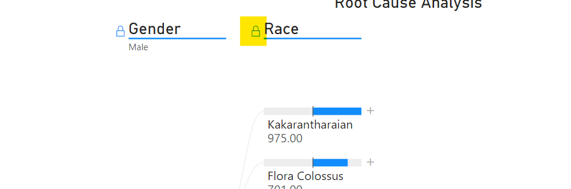

**Note:** For more details, please see [Decomposition tree](https://docs.microsoft.com/en-us/power-bi/visuals/power-bi-visualization-decomposition-tree) in Microsoft Doc.

# Smart Narrative

1. Do the [Preparation Step](AIVisualLab.md#preparation) if it has not been done already.

2. In the Visualizations pane, select a stacked bar chart.

* With the stacked bar chart visual selected:
* Drag the **Alignment** field to Axis.
* Drag the **Weight** to Values.
* Click the dropdown next to **Weight** in the Values, change it from **sum** to **average**.

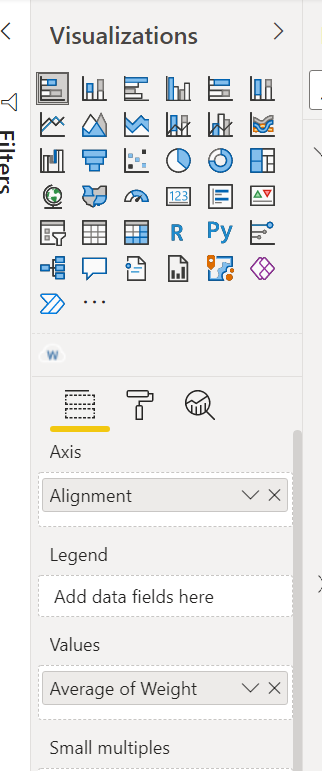

3. In the Visualizations pane, select a 100% stacked column chart.

* With the 100% stacked column chart visual selected:
* Drag the **Hair color** field to Axis.
* Drag the **Alignment** field to Legend.
* Drag the **Alignment** to Values, make sure it is showing as **Count of Alignment**

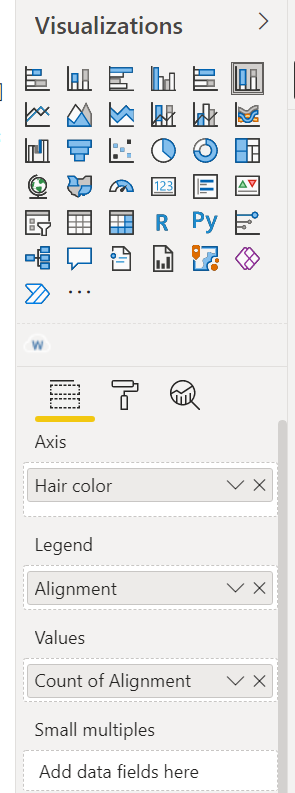

4. In the Visualizations pane, select a smart narrative chart. A text box will automatically render based on the content you have on the page.

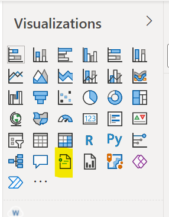

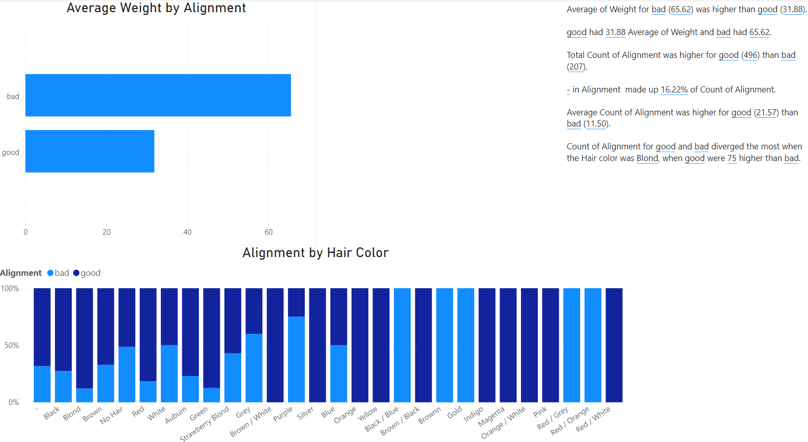

5. You can add your own narratives by click on the smart narrative text box, in this example, type in **Average height is** , then click on **+Value** . In **How would you calculate this value**, type in **Average height**, in **name your value**, type in **avgheight**, click **save**

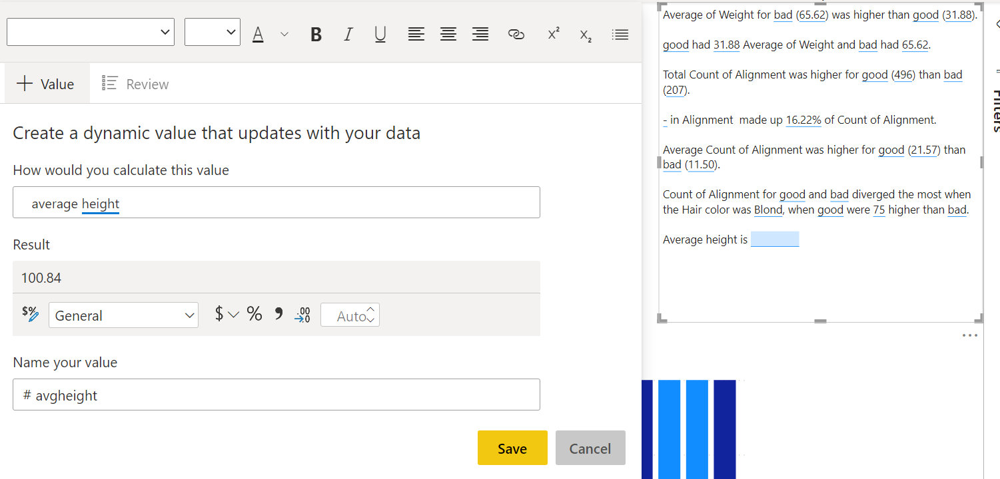

6. The text box content (including the values you created) will dynamically update as you cross filter on other visuals

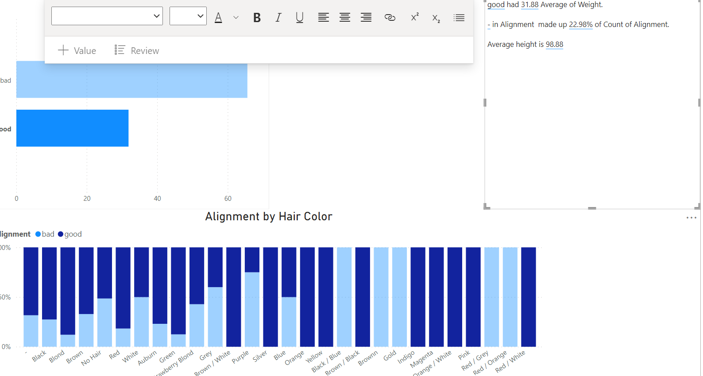

7. You can click **Review** to see and manage all the values you have created.

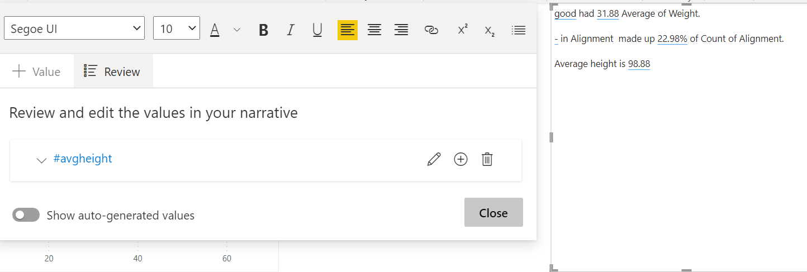

**Note:** For more details, please see [Smart narrative](https://docs.microsoft.com/en-us/power-bi/visuals/power-bi-visualization-smart-narrative) in Microsoft Doc.

# Anomaly Detection

1. Download the [csv file](https://raw.githubusercontent.com/lipinght/PBICookbook/main/AdvAnalytics/train.csv)  (Open in a new window, right click, click **save as**)

2. Open Power BI Desktop, click **Get Data** on home tab, choose **Text/CSV** and choose the csv file downloaded in step 1, and click **open**, click **load**.

3. In the Visualizations pane, select a line chart.

* With the line chart visual selected:
* Drag the **Order Date** field to Axis.
* Drag the **Sales** to Values.

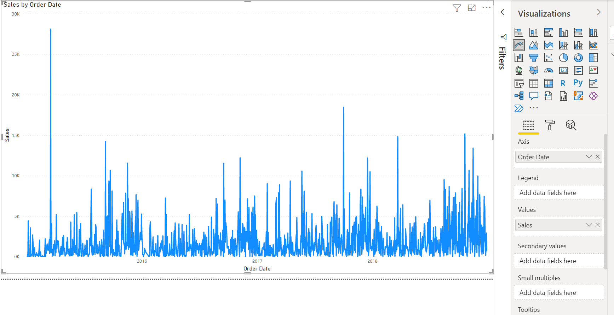

4. Click **publish** on the ribbon on home tab.(skip if you dont have power bi service access)

5. Choose the workspace you created in the [prerequisite](Prerequisite.md#provision-workspace), click **select**. You might be prompted to give your pbix a name and save it before publish you have not saved your pbix before.(skip if you dont have power bi service access)

6. After the report is published, you can go to the report by clicking **Open xxxx.pbix** in Power BI, or go to power bi workspace, and navigate to the report that you published.(skip if you dont have power bi service access)

7. Click on **get insights**, then click on **Anomalies in Sales**(skip if you dont have power bi service access)

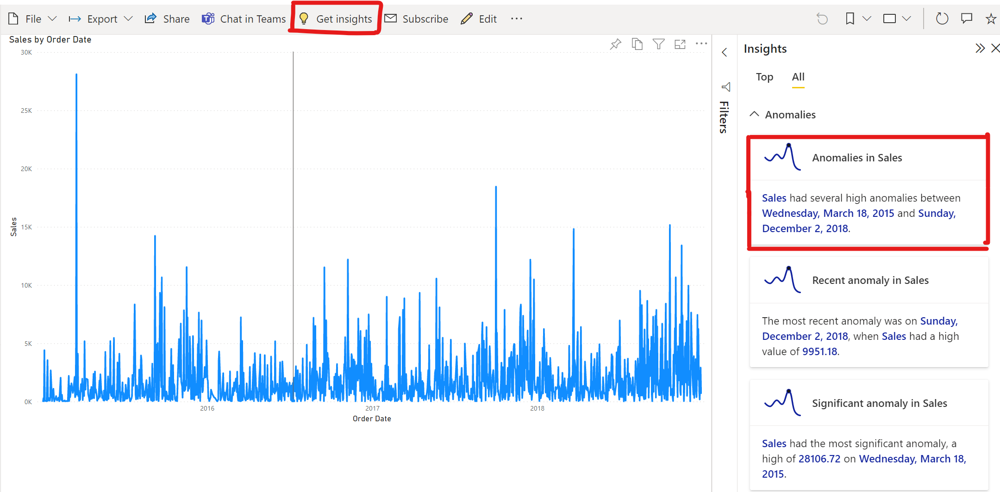

8. You can now click through different anomalies and see explanations.(skip if you dont have power bi service access)

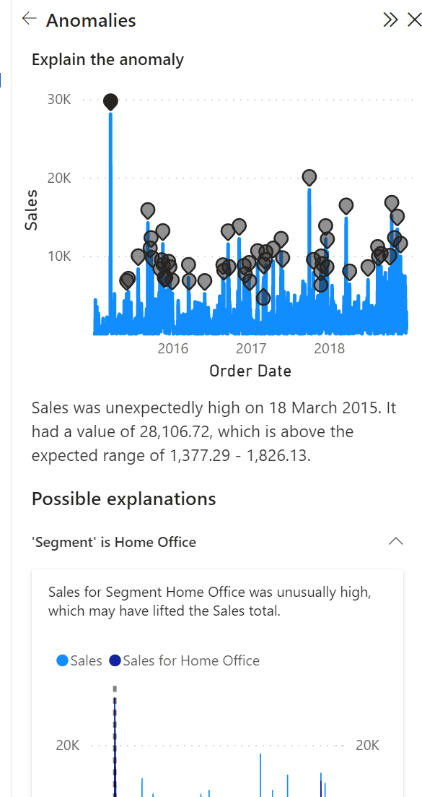

9. Go back to Power BI desktop, in the Analytics well, expand **Find anomalies**, click **+add**. 

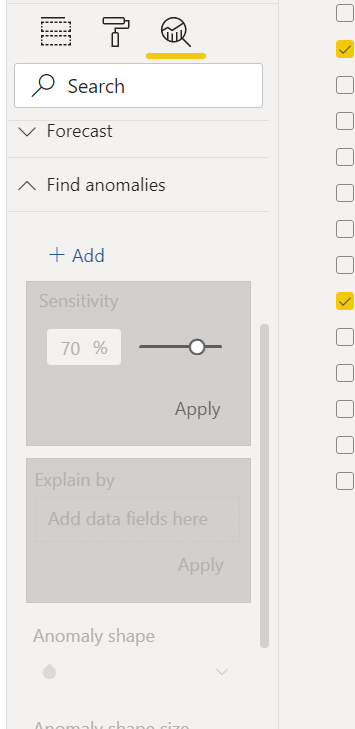

10. Drag **Region, Segment, City, Category** to explain by, and click **Apply**, You can also change sensitivity level and click **Apply**, different sensitivity level will determine how many anomalies are shown.

11. Click on different anomality data points to see some of the possible explanations. You may observe that anomaly detection in Power BI Service done in step 7 is offering more explanations than Power BI desktop.

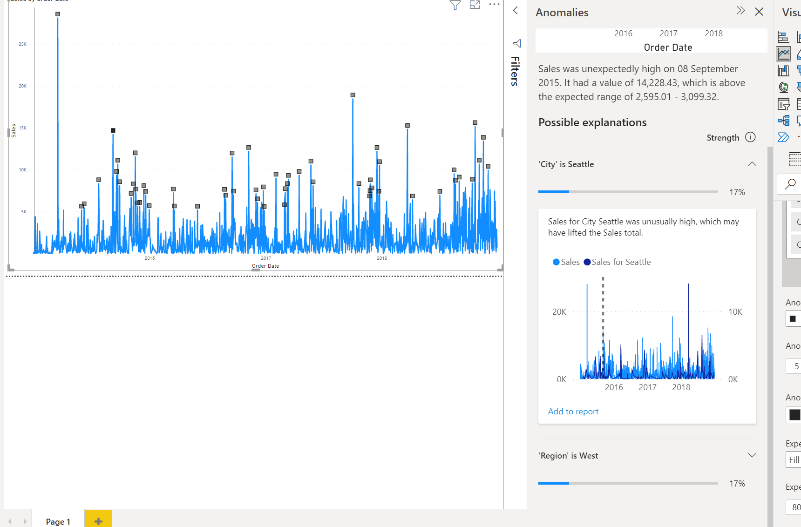

12. You can add the explanations visuals to report by clicking on **add to report**

**Note:** For more details, please see [Anomaly detection](https://docs.microsoft.com/en-us/power-bi/visuals/power-bi-visualization-anomaly-detection) in Microsoft Doc.
