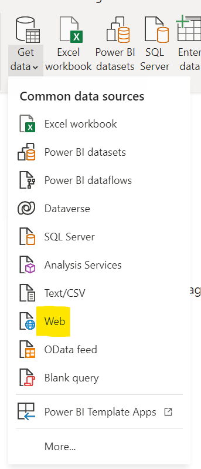
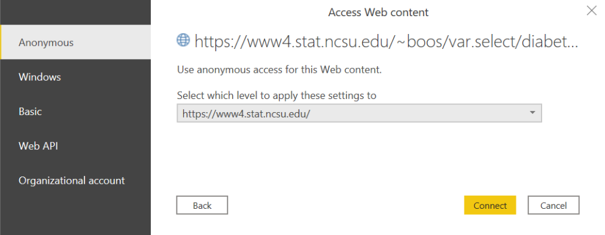
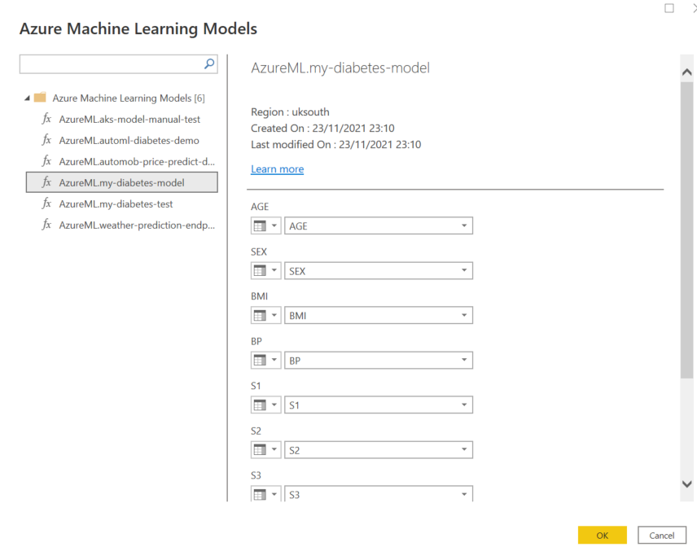
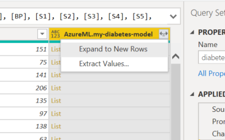
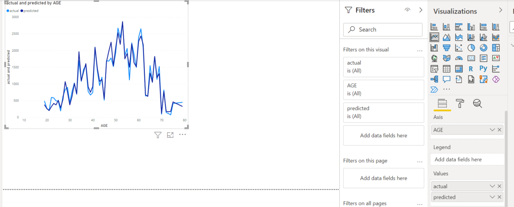

# Azure Machine Learning Integration Lab

This lab walks through Power BI Integration with Azure Machine Learning

# Create an Azure Machine Learning workspace

In the Azure portal, create a new Machine Learning resource, specifying the following settings:

Subscription: Your Azure subscription
Resource group: Create or select a resource group
Workspace name: Enter a unique name for your workspace
Region: Select the geographical region closest to you
Storage account: Note the default new storage account that will be created for your workspace
Key vault: Note the default new key vault that will be created for your workspace
Application insights: Note the default new application insights resource that will be created for your workspace
Container registry: None (one will be created automatically the first time you deploy a model to a container)

Once deployment is successful, go to the overview page of the machine learning resource, and click **Launch Studio**

# Create a compute instance

In Azure Machine Learning studio, view the Compute page. On the Compute instances tab, add a new compute instance with the following settings. You’ll use this as a workstation to run code in notebooks.
Compute name: enter a unique name
Location: The same location as your workspace
Virtual machine type: CPU
Virtual machine size: Standard_DS11_v2
Total Available Quotas: This shows dedicated cores available.
Show advanced settings: Note the following settings, but do not select them:
Enable SSH access: Unselected (you can use this to enable direct access to the virtual machine using an SSH client)
Enable virtual network: Unselected (you would typically use this in an enterprise environment to enhance network security)
Assign to another user: Unselected (you can use this to assign a compute instance to a data scientist) 3.Wait for the compute instance to start and its state to change to Running.

# Clone and run a notebook

Launch Jupyter and JuypyterLab once the compute instance is created and running, on the top right, click **new** and select Terminal to open a terminal, and ensure that the current path is the /users/your-user-name folder.


Enter the following command to clone a Git repository containing notebook we will use to your workspace:

```git
git clone https://github.com/lipinght/PBICookbook
```

When the command has completed, in the files tab in jupyter, click ↻ to refresh the view and verify that a new /users/your-user-name/PBICookbook folder has been created, browse to **/users/your-user-name/PBICookbook/AdvAnalytics**, Open **DiabetesRealTimeInference.ipynb**, run each code cell in turn.

**Note:** the deployment will take 5-7 minutes, once completed, the output will read **Succeeded
ACI service creation operation finished, operation "Succeeded"**

# Consume Model in Power BI

Open Power BI Desktop, click on **Get Data** and select **Web**



select **Basic**, In URL enter following text, click **OK**.

```txt
https://www4.stat.ncsu.edu/~boos/var.select/diabetes.tab.txt
```

Select **Anonymous** and click **Connect**



Select **Transform data** to open the Power Query Editor, select the **Azure Machine Learning** button in AI insights.


After signed in to your azure account, you will see a list of real time inference endpoints available to you, select **my-diabetes-model** which you deployed in the previous step, click **OK**.It triggers a warning on data privacy for both the data and the endpoint.In the next screen, select **Ignore Privacy Levels checks for this file > Save**.



The scoring will add an additional column named **AzureML.my-diabetes-model** The data that the service returns is a list.To get the predictions, select the double-headed arrow in the AzureML.my-diabetes-model column header > Expand to New Rows.



Follow these next steps to finish cleaning up your data model.

* Rename the **AzureML.my-diabetes-model** column to **predicted**: right click column header, select **rename**.
* Rename the **Y** column to **actual**: right click column header, select **rename**.
* Change the type of the **actual** column: right click column header, select **Change Type** > **Decimal Number**.
* Change the type of the **predicted** column: right click column header, select **Change Type** > **Decimal Number**.
* On the Home ribbon, select **Close & Apply**.

Build a visual to show the difference between actual and predicted.

* In the Visualizations pane, select a Line chart.
* With the line chart visual selected:
* Drag the **AGE** field to the Axis.
* Drag the **actual** field to Values.
* Drag the **predicted** field to Values.



You can then publish the report to Power BI Service and schedule a refresh for the dataset.