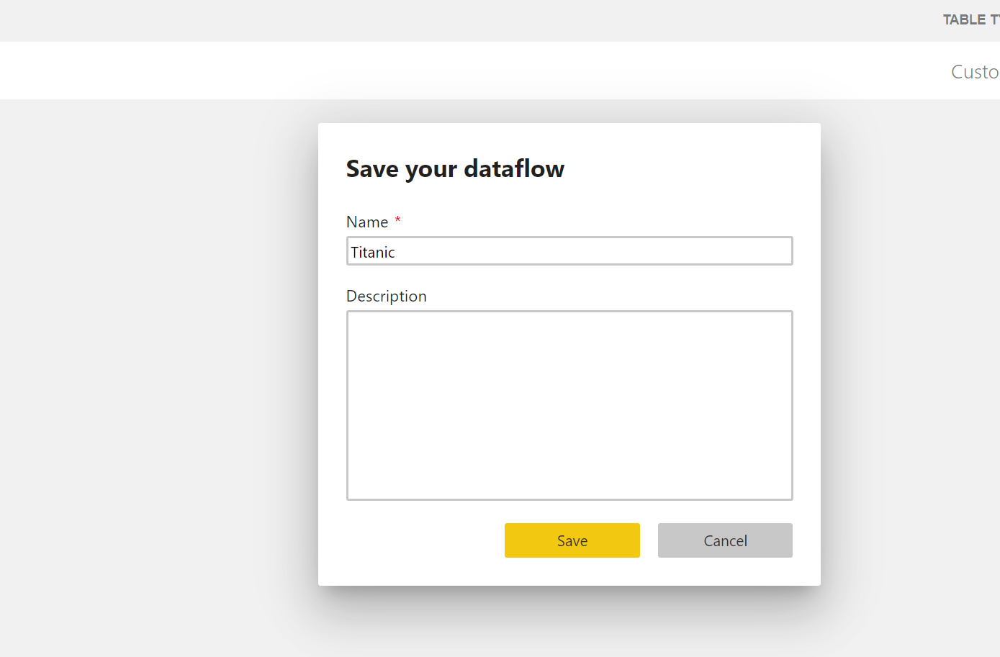

# Auto ML Lab
This lab walks through how to use Auto ML feature within Power BI Service

**Note:** In order to do this lab, you will need access to premium or premium per user capacity.

1. Go to Powerbi.com and nagivate to a workspace that is in a premium or premium per user capacity

2. Click on **New** and select **Dataflow**

3. Click on **Add new tables** 

4. Click on **Text/CSV**, for **File path or URL** input below url, click **Next**, click **Transform Data** in the next page
https://raw.githubusercontent.com/lipinght/PBICookbook/main/AdvAnalytics/titanic.csv

5. Click the "123" on column **Survived** and change it to **True/False**, click **Add new Step** when prompted and click **Save & Close**

6. Give your dataflow a name, in this case "Titanic" and click **Save**

7. Click second icon "apply ml model" under actions and click on "Add a machine learning model" 

8. For Outcome Column, select the dropdown to be **Survived**, click **Next**

9. For Choose a target outcome, select the dropdown to be **true**, click **Next**

10. You can select the attributes to be included in the model, Power BI makes recommendations, we will stick with the recommendations, and click **Next**

11. Type in Model name, in this case "Titanic Model", Choose a proper amount of time for model to train, taking into account the lab durations, we will do "21 minutes", in reality, you want to give it sufficient time to go through all the algorithms and hyperprarameters and click **Save and Train**

