# Image Tagging Lab
This lab walks through the Power BI Integration with Cognitive Services for Image Tagging

**Note:** In order to do this lab, you will need access to premium or premium per user capacity. Do the [prerequisite](Prerequisite.md#provision-workspace) before starting the lab

# Image Tagging
1. Click the ... on the visualization pane, and click **get more visuals**

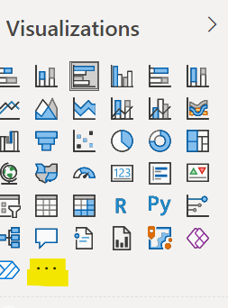

2. Search for  **image grid**, click into it and then click **Get it Now**

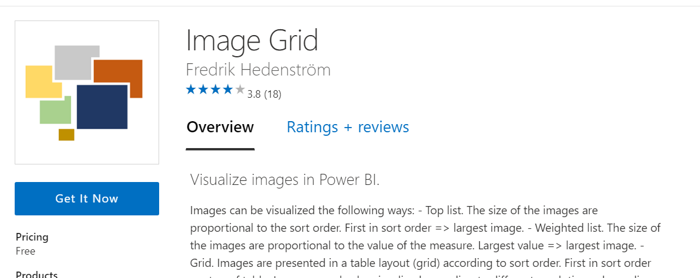

3. Download the [xlsx file](https://raw.githubusercontent.com/lipinght/PBICookbook/main/AdvAnalytics/ImageTagging.xlsx) (Open in a new window, right click, click **save as**)

4. Open Power BI Desktop, click **Get Data** on home tab, choose **Excel Workbook** and choose the xlsx file downloaded in step 1, and click **open**,  a preview of the data will load, click **transform data**.

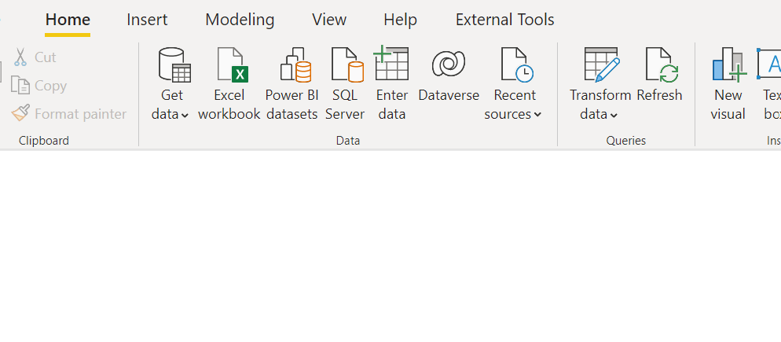

5. Once in power query editor view, click **Use First Row as Headers** and click **Close & Apply**.

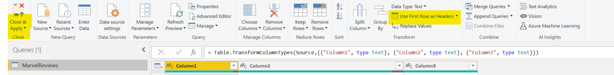

6. Click "Vision" in AI insights in Power Query Editor Window.

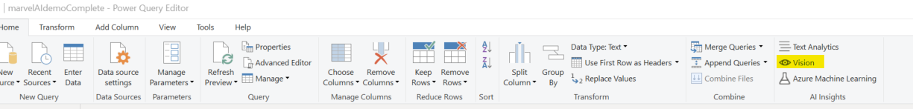

7. In the pop up window, select **tag images** and choose **URL** as the column in Image to be analyzed, click **OK**

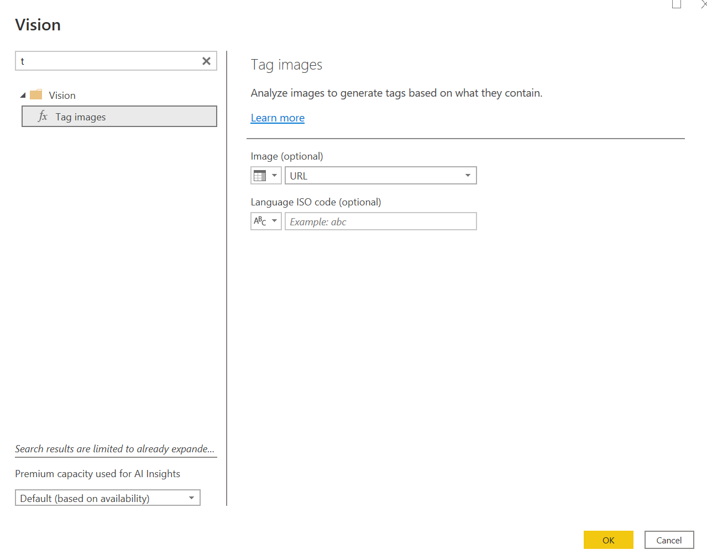

**Note:** It triggers a warning on data privacy.In the next screen, select **Ignore Privacy Levels checks for this file > Save**.

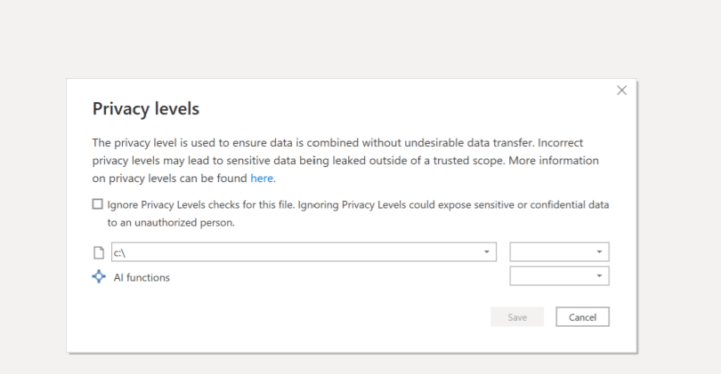

8. The tagged labels are return. click **Close & Apply** on the home tab.

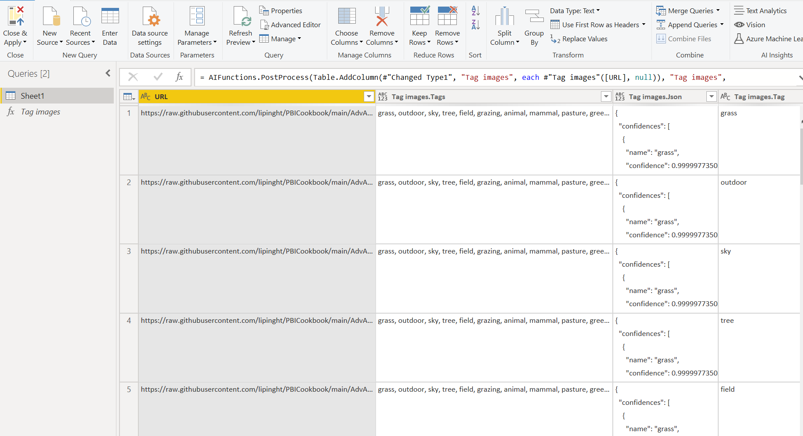

9. click on the visual **image grid** and put column **URL** into the **image URL** field

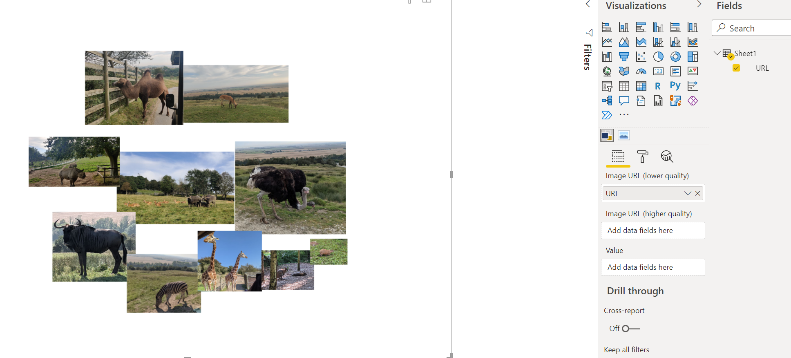

10. Click on the **slicer** visual and put column **tag images.tag** into the field **Field**

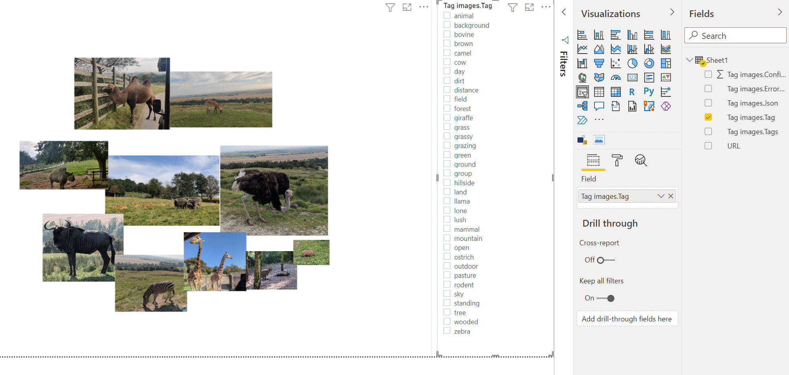

11. Now you can interact with the visuals using tagss

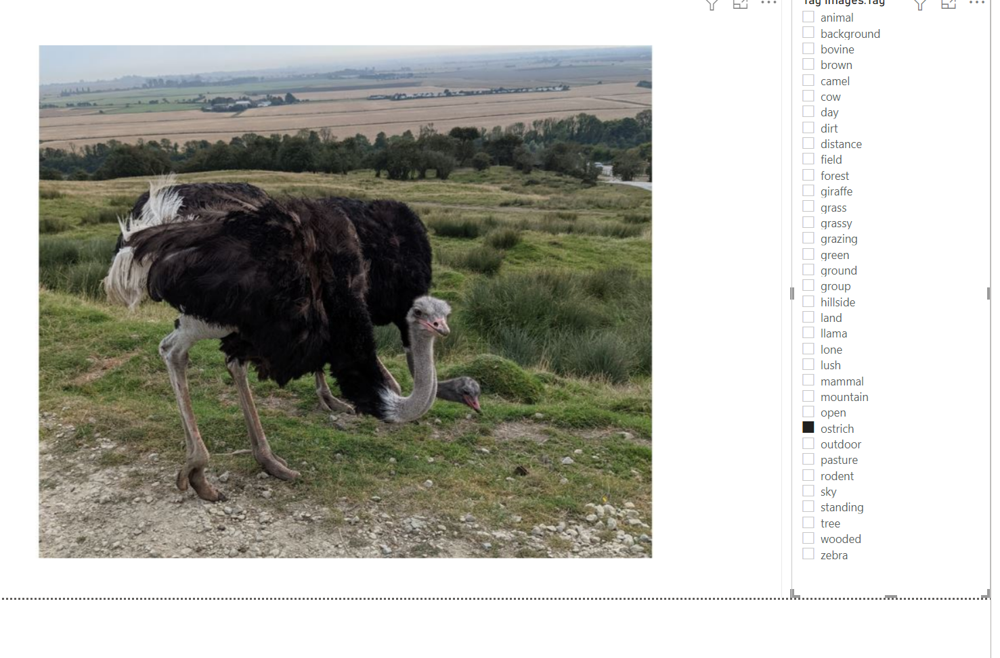
