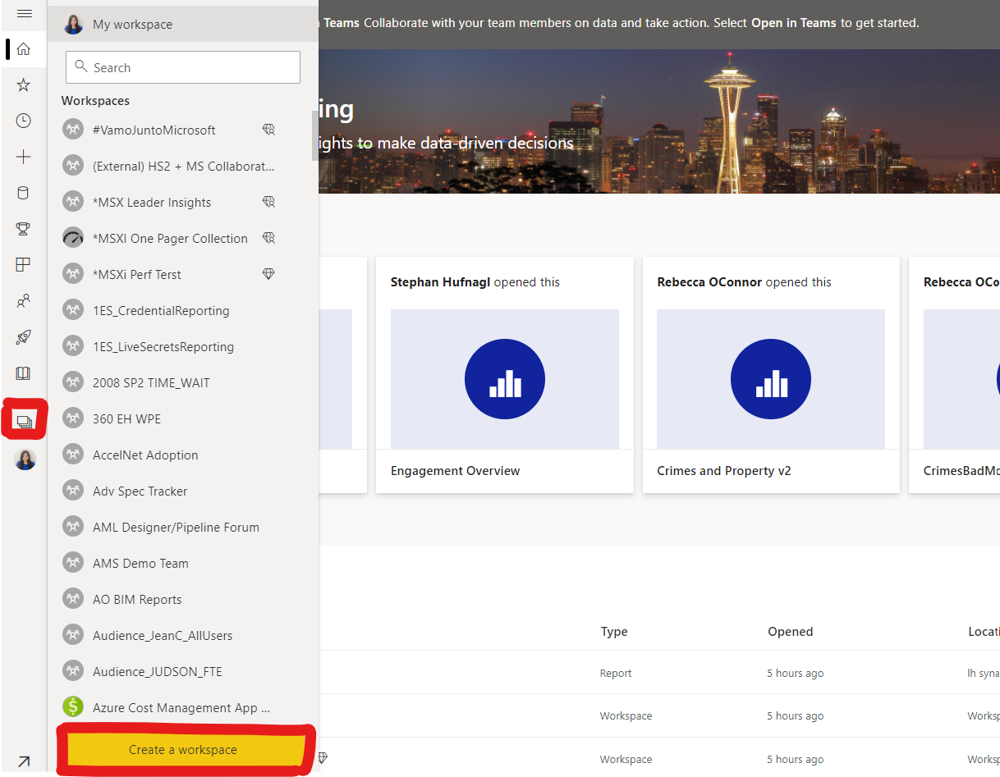
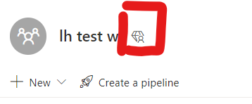
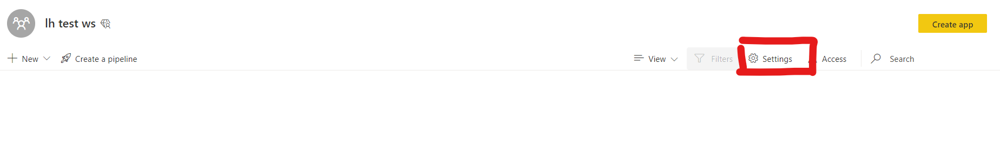

# Download latest version of Power BI Desktop

Download and install the [latest version](https://www.microsoft.com/en-gb/download/details.aspx?id=58494) of Power BI Desktop. 

# Provision Workspace

Some of the labs in this series require premium or premium per user workspace.

If you already have access to a premium or premium per user workspace in Power BI service, ignore this step. Otherwise, go to [powerbi.com](https://powerbi.microsoft.com/), sign in on top right, create a workspace

Name the workspace and then click **save**. 

If you have a premium per user license, the workspace you created will be on prepmium per user capacity automatically, premium per user capacity is shown as a symbol with a diamond and a person

If you do not have premium per user license, click **Settings**

Click on **premium**, and assign your workspace to a **premium per capacity** that you have access to, click **Save**.

# AML Intergration Lab Prerequisite 

* Only run this prerequisite step if you are doing the AML integration lab.
* If you already have an available Azure Machine Learning workspace and a compute instance, ignore this step.

## Create an Azure Machine Learning workspace

In the Azure portal, create a new Machine Learning resource, specifying the following settings:

* Subscription: Your Azure subscription
* Resource group: Create or select a resource group
* Workspace name: Enter a unique name for your workspace
* Region: West Europe
* Storage account: Note the default new storage account that will be created for your workspace
* Key vault: Note the default new key vault that will be created for your workspace
* Application insights: Note the default new application insights resource that will be created for your workspace
* Container registry: None (one will be created automatically the first time you deploy a model to a container)

Once deployment is successful, go to the overview page of the machine learning resource, and click **Launch Studio**

## Create a compute instance

In Azure Machine Learning studio, view the Compute page. On the Compute instances tab, add a new compute instance with the following settings. You’ll use this as a workstation to run code in notebooks.

* Compute name: enter a unique name
* Location: West Europe
* Virtual machine type: CPU
* Virtual machine size: Standard_DS11_v2
* Total Available Quotas: This shows dedicated cores available.
* Show advanced settings: Note the following settings, but do not select them:
* Enable SSH access: Unselected (you can use this to enable direct access to the virtual machine using an SSH client)
* Enable virtual network: Unselected (you would typically use this in an enterprise environment to enhance network security)
* Assign to another user: Unselected (you can use this to assign a compute instance to a data scientist) 3.Wait for the compute instance to start and its state to change to Running.