# Text Analytics Lab
This lab walks through the Power BI Integration with Cognitive Services for Sentiment Scoring and Key Phrase Extraction

**Note:** In order to do this lab, you will need access to premium or premium per user capacity.

# Preparation 
1. Download the [csv file](https://raw.githubusercontent.com/lipinght/PBICookbook/main/AdvAnalytics/MarvelReviews.csv) 

2. Open Power BI Desktop, click **Get Data** on home tab, choose **Text/CSV** and choose the csv file downloaded in step 1, and click **open**, once the preview of the data loads, click **load**.

# Sentiment Score
3. Click **Transform Data** on the home tab.

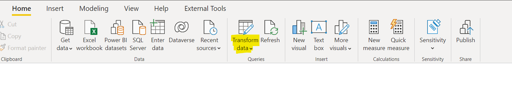

4. Click "Text Analytics" in AI insights in Power Query Editor Window.

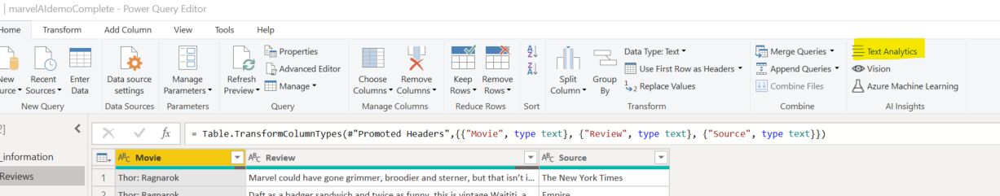

5. In the pop up window, select **score sentiment** and choose **Review** as the column in Text to be analyzed, click **OK**

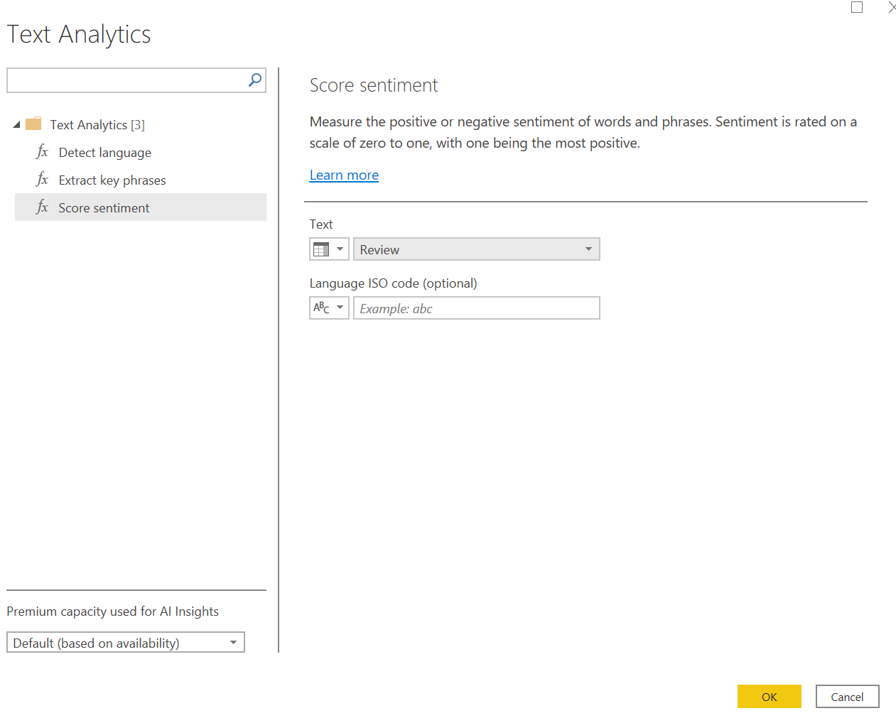

6. The sentiment score is then returned, sentiment score is between 0-1, closer it is to 1, the more positive the sentiment is, vice versa. click **Close & Apply** on the home tab.

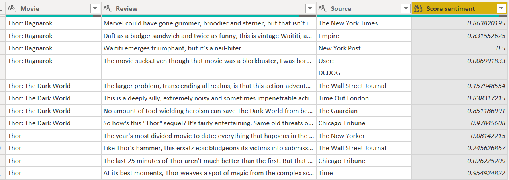

7. Click column **Score Sentiment** and change the data type from **Text** to **Decimal Number**

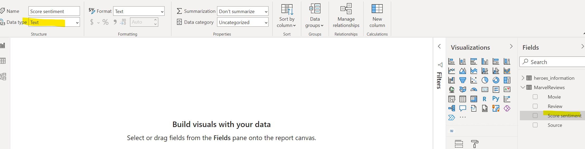

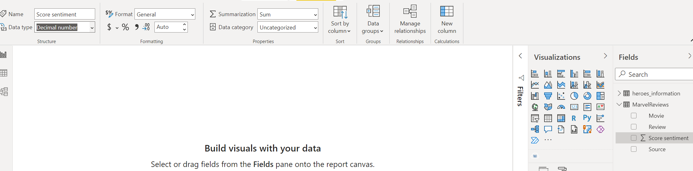

8. Now you can use sentiment score to build visualizations, below is an example

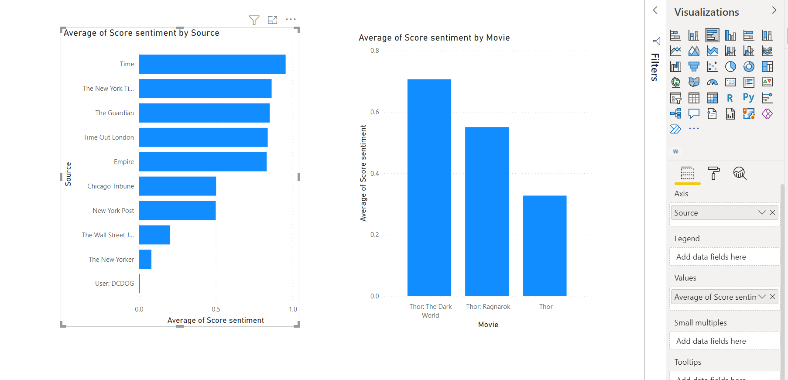

# Key Phrase Extraction
9. Click the ... on the visualization pane, and click **get more visuals**

10. Search for  **word cloud**, click into it and then click **Get it Now**

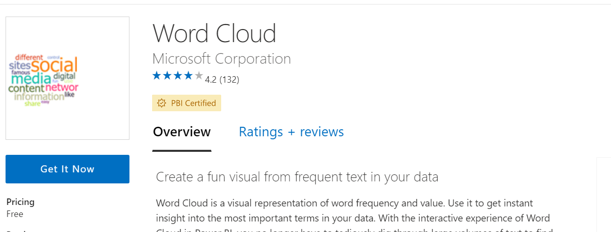

11. Click **Transform Data** on the home tab.

12. Click "Text Analytics" in AI insights in Power Query Editor Window.

13. In the pop up window, select **Extract Key Phrase** and choose **Review** as the column in Text to be analyzed, click **OK**

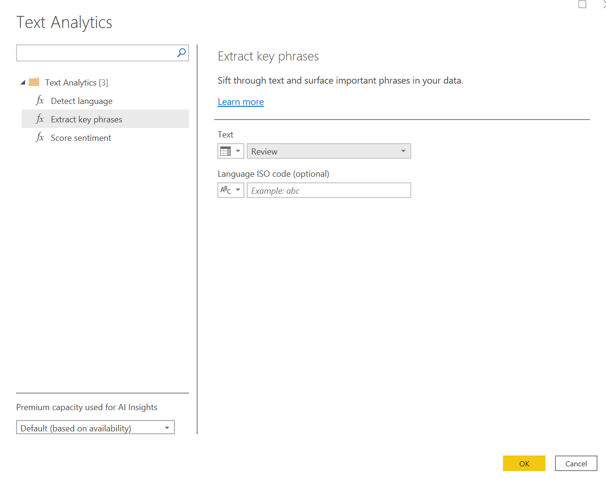

14. extracted will be returned,click **Close & Apply** on the home tab.

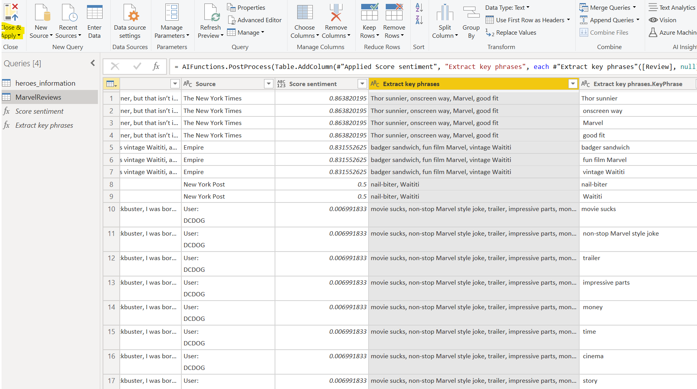

15. click **word cloud** icon in the visualization pane, and put **Extract Key Phrases.KeyPhrase** in the **Category** field

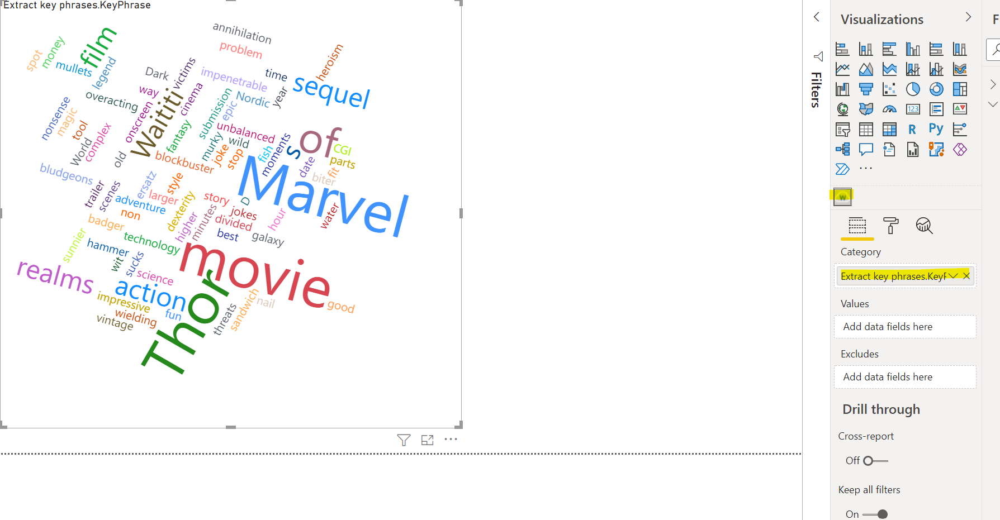
