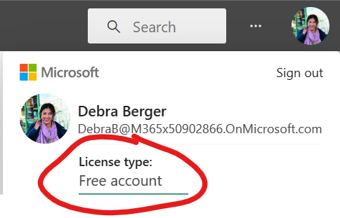

# PBI Pro License Automated Control
### Introduction
When a user is assigned an Office 365 E5 subscription, a Power BI pro licence (being part of the E5 package) is automatically assigned aswell. This may become an issue for organisations with many E5 licences distributed across their users, as a PBI Pro licence allows for a free-for-all in terms of content creation (unless otherwise restricted). 
 
In order to better control the initial assignment of a PBI Pro license and improve PBI governance, users can be added to security groups with the pro license enabled/disabled. Any user added to the group will inherit the license assignment of the security group. For example, if the security group has PBI Pro disabled, any user added to this group will inherit this restriction and will also have PBI Pro disabled. See the GIF below which illustrates this:       
 
 
 
 To better govern PBI Pro Licence assignment, consider the following method:
 1. Create two security groups, one with PBI Pro enabled and the other with PBI Pro disabled.
 2. Users by default are added to the group with PBI pro disabled.
 3. Should a user need a Pro licence, they submit a request.
 4. If the request is approved, they are transferred to the security group with the Pro Licence enabled.

We can take advantage of Power Automate to automate the entire process from when the user submits a request. See the diagram below which illustrates the architecture, (link to the whitepaper can be found at the bottom):


<sub> *1. Power BI pro licences can be procured using different methods, such as via an E5 licence.</sub>

I would highly recommend building this flow from scratch to get a better understanding of the entire process. However the template can be downloaded [here](https://github.com/huzeifah-m/PBI-Pro-License-Automated-Control/blob/main/AutomatedLicenseFlow_20230223104740.zip)

**Note -** The permissions/connectors will need to be reassigned to yourself if using the template. 

### Pre-requisites
•	**Power Automate licence**

•	**Permissions to create/use an [Azure Active Directory Security Group](https://docs.microsoft.com/en-us/azure/active-directory/fundamentals/active-directory-groups-create-azure-portal)**

•	**Procured E5 licences available to assign**

•	**MSForm for end user to fill in**, which is set so only members of your organisation can respond. Here organisations can customise the form to meet their needs such as including terms of use, rules to follow etc..:


• **Create a Security group with E5 assigned (and PBI Pro enabled):**

From the Azure Active Directory page within the Azure portal, create a new security group, add a suitable name, description. Then assign E5 licences to the security group:
 


# Building Flow Architecture
 •	Navigate to [make.powerautomate.com]() and sign in.
 
 • Select the 'Create' tab and start a new flow by selecting 'Automated cloud flow'. Then select the MSForms trigger 'When a new response is submitted'.
 
   
 
 •	For the Form ID drop down, select the pre-created form. In the example below the MSForm is titled "Power BI Pro".
 
 •	Click 'New step' and select the MSForms 'Get repsonse details' action. Again select the required form for Form ID. For the response ID, in the pop-up box, select the dynamic MSForm content 'Response ID'.
 
  
 
 •	Add a new step by selecting the Office 365 action 'Get User Profile', which returns the user's details. For the 'User' input, select the MSForms action 'Responder's email' to dynamically return the email address of the form responder.
 
 
 
 •	Add a new step using the Teams action 'Post adaptive card and wait for a response'. This can be customised according to your needs, in this example a teams message is sent to the admin as a flow bot in a chat on teams requesting for their approval/rejection. A json code is generated for the design of the adaptive card which can be found [here](Teams%20Adaptive%20Card%20json.txt)
 
  
 
 Here is an example of the Teams message the admin will receive:
 
 
 
 •	We need to cover either case of approval or rejection, to do this we can add a 'Condition' action. Enter the below expression as the input for the condition:
 
 ```
 body('Post_Adaptive_Card_and_wait_for_a_response')?['submitActionId']
 ```
 
 
 
 •	When a request is denied, the responder can be notified via email. Add a 'Send an email' action as illustrated below to automatically send an email to the responder. To include the approver's message in the email, an expression that contains the clarification (reason for rejection) field from the adaptive card is used as a variable in the email:
```
body('Post_Adaptive_Card_and_wait_for_a_response')?['data']?['clarification'] 
```

  
 
 •	For the 'Yes' case (request has been approved) we need to check whether the user is already a member of the desired security group. Add a Azure AD 'Check group membership' action, which returns the given id if the user is a member of the group. Else the result will be empty. Select a dynamic ID input for 'User' and input the desired group ID for 'Group ID'. The group ID can be found in the overview page of the group in the Azure portal:

 •	Add a 'Condition', we input the 'value' from the previous step and check whether the desired group ID is contained in the result.
 
 
 
  
 
 •	In the 'Yes' case where the user is not part of the group, we can dynamically add them to the group using the Azure AD 'Add user to group' action. We use the specified group ID and the dynamic User ID connector as inputs for this action.
 
 •	Using some form variables, send the user a confirmation email confirming their application has been approved and a licence has been issued.
 
 •	In the 'No' case where the user is already a member of the group, a notification email is sent to the user using variables from the form.
 
  
 
  
 
 To check whether a Pro licence has been assigned to you navigate to [https://app.powerbi.com/](). Click on your profile image and the licence type will be displayed. If the flow was unsuccessful the licence type will remain as 'Free', if the flow ran successfully the licence type should change to 'Pro':

   
 
 # Wrapping up
 This is what the complete automate flow looks like: 
 
 
 
Once again I would highly recommend building this flow from scratch to get a better understanding of the entire process. However you can download the template here [https://github.com/huzeifah-m/PBI-Pro-License-Automated-Control/blob/main/AutomatedLicenseFlow_20230223104740.zip]()
 
**Here are some additional links which may help:**

What is group-based licensing in Azure Active Directory? - [https://learn.microsoft.com/en-us/azure/active-directory/fundamentals/active-directory-licensing-whatis-azure-portal]()

Licensing the Power BI service for users in your organization - [https://learn.microsoft.com/en-us/power-bi/enterprise/service-admin-licensing-organization]()

Enable or disable self-service sign-up and purchasing - [https://learn.microsoft.com/en-us/power-bi/enterprise/service-admin-disable-self-service]()

Power BI enterprise deployment whitepaper - [https://learn.microsoft.com/en-us/power-bi/guidance/whitepaper-powerbi-enterprise-deployment]()
