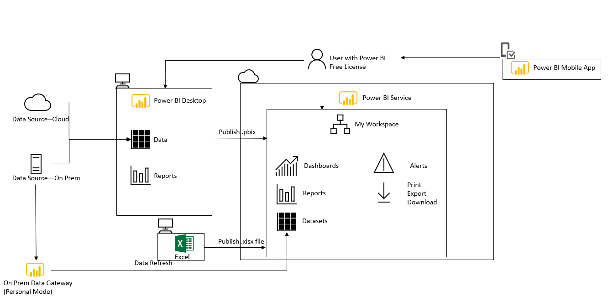
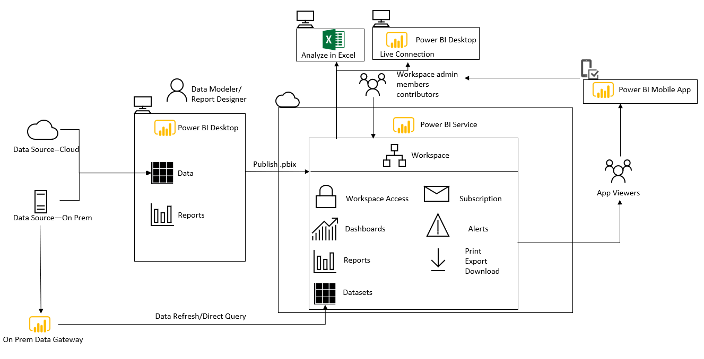
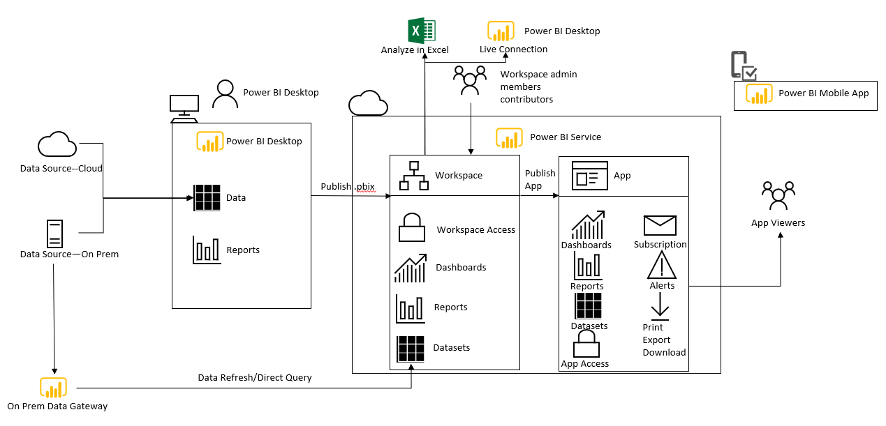
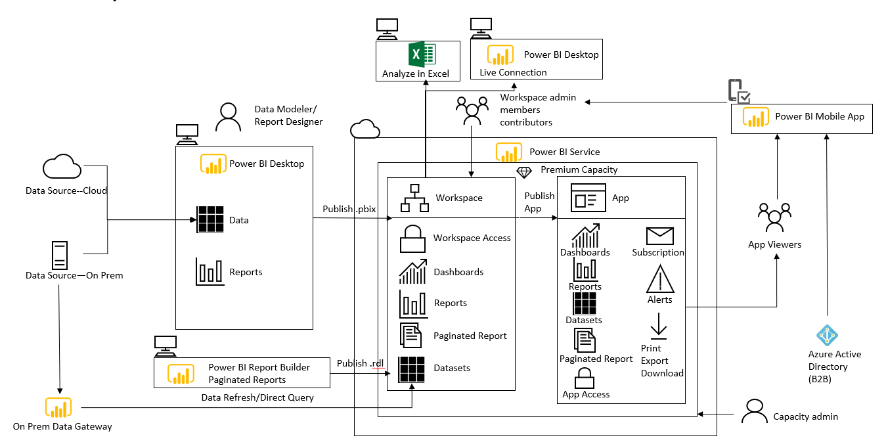
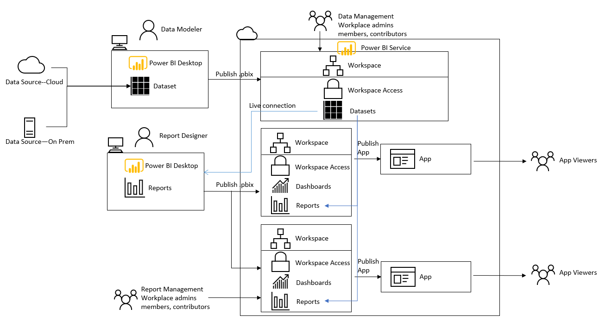
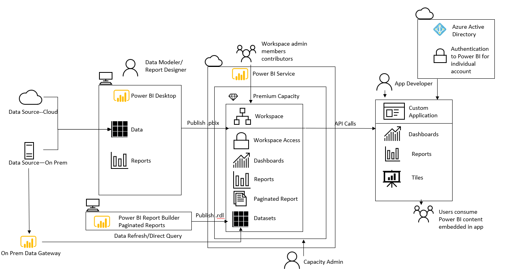
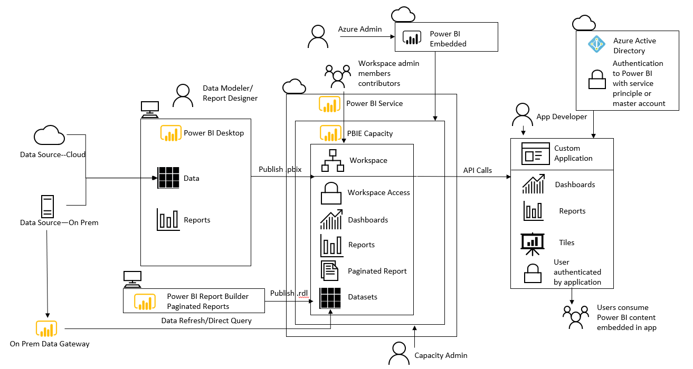

This Section will cover different deployment patterns for Power BI Service based on distinctive organizational needs.

| Deployment Pattern | Description | 
|:------------------------:|:-----------------------:|
| [Personal BI](DeploymentPatterns/DeploymentPatterns.md#personal-bi) | This deployment pattern applies to situations where users are authoring Power BI reports for personal use with no sharing or collaboration.  |
| [Small Team Collaboration](DeploymentPatterns/DeploymentPatterns.md#small-team-collaboration) | This deployment pattern applies to situations where users are working within a small group, collaboration and distribution could be handled within a workspace.  |
| [Large Team Collaboration and Distribution](DeploymentPatterns/DeploymentPatterns.md#large-team-collaboration-and-distribution) | This deployment pattern applies to situations where users are working with a large team, where the complexity for collaboration and distribution needs grows beyond using just a workspace. |
| [Enterprise Content Distribution](DeploymentPatterns/DeploymentPatterns.md#enterprise-content-distribution) | This deployment pattern applies to situations where Power BI contents are created largely by central teams and there are significantly large amount of content consumers vs content creators.  |
| [Centralized Datasets for Corporate Reporting](DeploymentPatterns/DeploymentPatterns.md#centralized-datasets-for-corporate-reporting) | This deployment pattern applies to situations where users are working with an enterprise deployment and would like to reuse and share Power BI datasets for different reports.  |
| [Embedded for Internal](DeploymentPatterns/DeploymentPatterns.md#embedded-for-internal) | This deployment pattern applies to situations where users want to embed Power BI dashboards and reports into custom applications, SharePoint Online, Microsoft Teams, or even 3rd party application for internal/organzational consumption.   |
| [Embedded for External](DeploymentPatterns/DeploymentPatterns.md#embedded-for-external) | This deployment pattern applies to situations where users want to embed Power BI content into custom applications which are used externally by customers and partners.   |

[Link to Diagram PPT](DeploymentPatterns/images/Power%20BI%20Deployment%20Pattern.pptx)

# Personal BI
## Where does this pattern apply?
This deployment pattern applies to situations where users are authoring Power BI reports for personal use with no sharing or collaboration.  

## Type of Questions this Session will Address
*	What does a Personal BI deployment pattern look like?
*	What type of license is involved in this deployment pattern?
*	What artifacts how usually involved in this deployment pattern?

## Overview
*	Users use Power BI Desktop to author queries, datasets and reports
*	The .pbix file can be published to My Workspace for personal use
*	Power BI service can be used with a Power BI Free License if there is no sharing or collaboration
*	Users can use features such as reschedule data refresh, use dashboards and data alerts and cannot use features such as live connections, email subscriptions and analyze in Excel
*	On-Premises Data Gateway in Personal Mode supports data refresh , does not support live connection or direct query
*	Users can use Power BI mobile app

## Resources
For Details of this deployment pattern, please see Page 17 of the [Power BI deployment whitepaper](https://aka.ms/PBIEnterpriseDeploymentWP).
 
 
# Small Team Collaboration
## Where does this pattern apply?
This deployment pattern applies to situations where users are working within a small group, collaboration and distribution could be handled within a workspace.

## Type of Questions this Session will Address
*	What does a Small Team Collaboration deployment pattern look like?
*	What type of license is involved in this deployment pattern?
*	What artifacts how usually involved in this deployment pattern?
*	How should I set up workspace if I have a small team collaboration on it?

## Overview
*	Users use Power BI Desktop to author queries, datasets and reports 
*	The .pbix file is recommended to be sored in a common location such as OneDrive
*	All content creators and consumers require a Pro license unless the workspace has Premium capacity (in which case users with a Power BI Free license may view content which resides in Premium)
*	For a small team collaboration, team can use the workspace for both authoring and collaboration as well as distribution and delivery of content
*	Apps can be optionally used to deliver read-only content to users, unless small teams do not desire the additional management overhead for apps
*	Users can use features such as reschedule data refresh, use email subscriptions, dashboards and data alerts and are recommended to use features such as live connections and analyse in Excel
*	On-Premises Data Gateway in Standard Mode supports data refresh, live connection or direct query
*	Users can use Power BI mobile app
*	Users can use integration with Microsoft teams to facilitate data-driven decision-making

## Resources
For Details of this deployment pattern, please see Page 18 of the [Power BI deployment whitepaper](https://aka.ms/PBIEnterpriseDeploymentWP).
 
# Large Team Collaboration and Distribution
 ## Where does this pattern apply?
This deployment pattern applies to situations where users are working with a large team, where the complexity for collaboration and distribution needs grows beyond using just a workspace. In this deployment pattern, the recommendation is to use a workspace for collaboration and a app for distribution.

## Type of Questions this Session will Address
*	What does a large Team Collaboration deployment pattern look like?
* What type of license is involved in this deployment pattern?
* What artifacts how usually involved in this deployment pattern?
* How should I set up workspace and app if I have a large team collaboration on them?

## Overview
*	Users use Power BI Desktop to author queries, datasets and reports 
*	The .pbix file is recommended to be sored in a common location such as OneDrive
*	All content creators and consumers require a Pro license unless the workspace has been assigned to Premium capacity, in which case Power BI Free users may view content from the app (or the workspace if permissions allow).
*	For a large team collaboration, team can use the workspace for authoring and collaboration and the app distribution and delivery of content
*	Best practice is to limit access to the workspace to only the small amount of users who are handling authoring, development, and quality assurance activities
* Most users who will have read-only access to the content via app and not workspace
*	Users can use features such as reschedule data refresh, use email subscriptions, dashboards and data alerts and are recommended to use features such as live connections and analyse in Excel
*	On-Premises Data Gateway in Standard Mode supports data refresh, live connection or direct query
*	Users can use Power BI mobile app
*	Users can use integration with Microsoft teams to facilitate data-driven decision-making
 

## Resources
For Details of this deployment pattern, please see Page 21 of the [Power BI deployment whitepaper](https://aka.ms/PBIEnterpriseDeploymentWP).

# Enterprise Content Distribution
## Where does this pattern apply?
This deployment pattern applies to situations where Power BI contents are created largely by central teams and there are significantly large amount of content consumers vs content creators. Power BI premium becomes a cost-effective way to manage organizational level reporting.

## Type of Questions this Session will Address
*	What does enterprise content distribution deployment pattern look like?
* What type of license is involved in this deployment pattern?
* What artifacts how usually involved in this deployment pattern?

## Overview
*	Users use Power BI Desktop to author queries, datasets and reports 
*	The .pbix file is recommended to be sored in a common location such as OneDrive
* Organization/entperprise level implementation can take advantage of the cost-effectiveness Power BI Premium by having large amount of content consumers on free licenses
* Premium gives organizational level implementation dedicated compute capacity as opposed to the shared capacity that pro license gives.
* Larger implementations may also find advantages from the larger storage limits, larger dataset sizes, higher refresh rates, and other Premium features.
* External Power BI users can be added as guest users to organization's azure active directory, they can view content via browser, not mobile app.

## Resources
For Details of this deployment pattern, please see Page 22 of the [Power BI deployment whitepaper](https://aka.ms/PBIEnterpriseDeploymentWP).

# Centralized Datasets for Corporate Reporting
## Where does this pattern apply?
This deployment pattern applies to situations where users are working with an enterprise deployment and would like to reuse and share Power BI datasets for different reports. In this scenario, datasets and reports are seperated. Datasets may be developed by the central teams and there may be significantly more report creators publish reports to different workspaces. 

## Type of Questions this Session will Address
*	What does a centralized datasets for reporting deployment pattern look like?
*	What type of license is involved in this deployment pattern?
*	What artifacts how usually involved in this deployment pattern?
*	How should I set up workspaces if I want to have centralized datasets for enterprise reporting?

## Overview
*	Datasets and reports are decoupled, data modelers use Power BI Desktop to author datasets and report creators connect to shared Power BI datasets via a live connection. 
*	Workspace permissions are seperated for data management permissions and report publishing permissions.
*	Shared datasets serves as a semantic layer that provides "the single version of truth", organizations can choose to use Analysis Services or Direct Query to a Data Warhouse to serve the same purpose 
*	To allow access to the shared dataset, a “build” permission needs be assigned to the dataset. This allows approved report authors to create new content using the dataset. 

## Resources
For Details of this deployment pattern, please see Page 23 of the [Power BI deployment whitepaper](https://aka.ms/PBIEnterpriseDeploymentWP).

# Embedded for Internal
## Where does this pattern apply?
This deployment pattern applies to situations where users want to embed Power BI dashboards and reports into custom applications, SharePoint Online, Microsoft Teams, or even 3rd party application for internal/organzational consumption. 

## Type of Questions this Session will Address
*	What does a embed for my internal organization deployment pattern look like?
*	What type of license is involved in this deployment pattern?
*	What artifacts how usually involved in this deployment pattern?
* How does authentication and authorization work with embedded?

## Overview
* The whitepaper linked in this resource details the usage of Power BI Premium (P or EM Skus)for embedding for internal users.
*	Users use Power BI Desktop to author queries, datasets and reports, row-level security is set up in the same way as contents published in Power BI Service
* Power BI Rest API is used for embedding dashboards and reports 
* Datasets, dashboards and reports should be published to a specific Power BI workspace which has been designated for the embedded analytics project. 
* When embedding content at organizational level using Power BI Premium, users are authenticating via AAD based on their own AAD account. This allows same row-level security configuration as previous scenarios.
* All users need a Pro license or contents need to reside in a workspace backed by premium capacity.

## Resources
For Details of this deployment pattern, please see Page 26 of the [Power BI deployment whitepaper](https://aka.ms/PBIEnterpriseDeploymentWP).
 
# Embedded for External
## Where does this pattern apply?
This deployment pattern applies to situations where users want to embed Power BI content into custom applications which are used externally by customers and partners. 

## Type of Questions this Session will Address
*	What does a embedded for external customers deployment pattern look like?
*	What type of license is involved in this deployment pattern?
*	What artifacts how usually involved in this deployment pattern?
*	How does authentication and authorization work with embedded?

## Overview
*	The whitepaper linked in this resource covers in detail the usage of Power BI Embedded (A SKUs) Licence in embedding content for external users 
*	Users use Power BI Desktop to author queries, datasets and reports, and contents can published in Power BI Service as normal. If required, row level security can be defined.
* Power BI Rest API is used for embedding contents
* Datasets, dashboards and reports should be published to a specific Power BI workspace which has been designated for the embedded analytics project. 
* When embedding via Power BI Embedded application users are authenticated and authorized by the application and not application users do not need Power BI license. The application connects to Power BI through AAD based on service principle or master account.
* Power BI embedded service can be paused when not in use and scaled up or down to handle varying workload levels.

## Resources
For Details of this deployment pattern, please see Page 27 of the [Power BI deployment whitepaper](https://aka.ms/PBIEnterpriseDeploymentWP).
 
