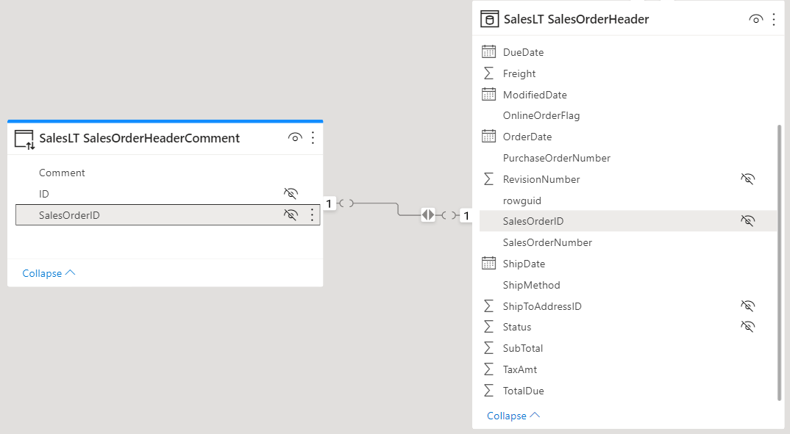
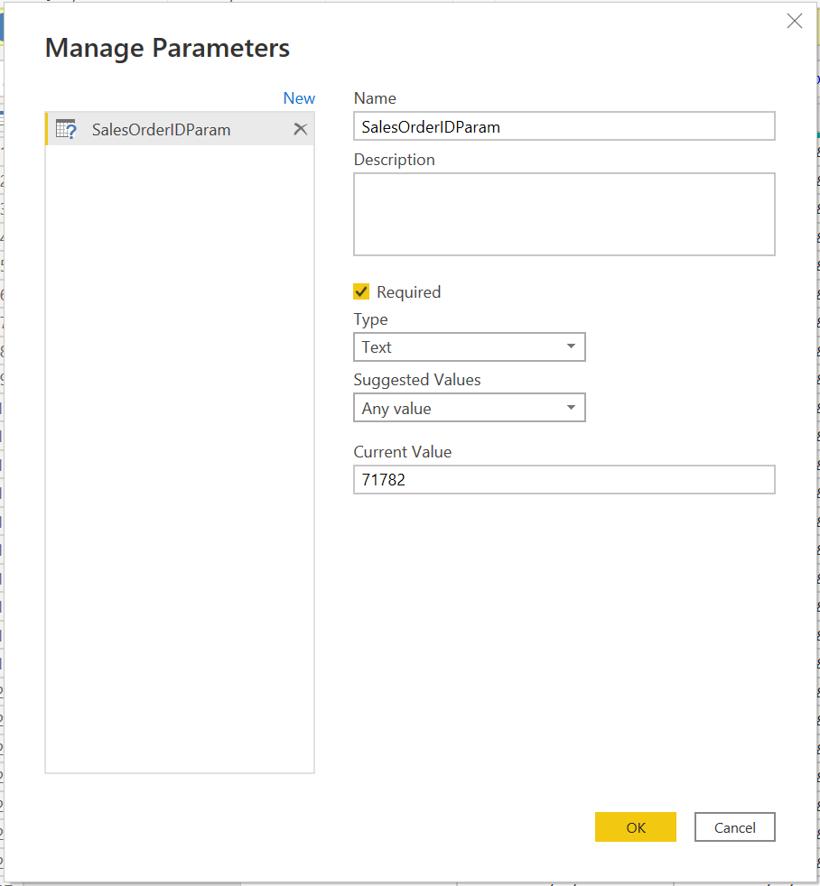
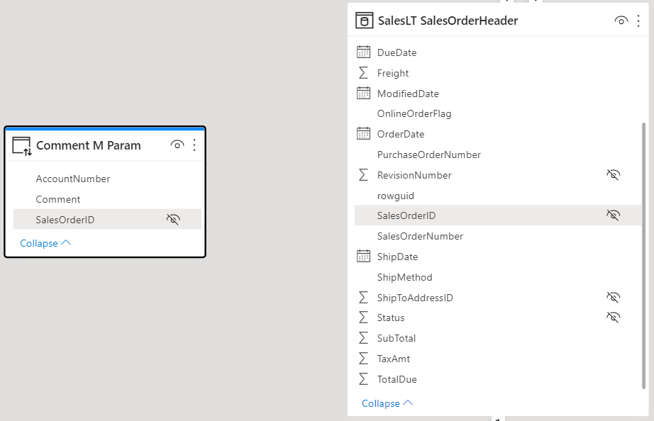
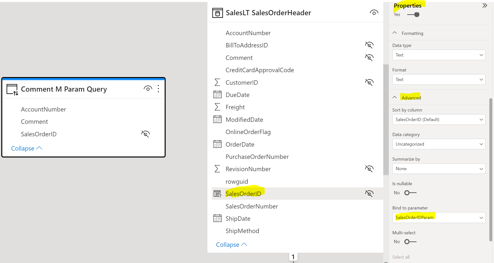

# Long Strings Reporting

There's often a need to report plain text comments or annotations at the fact row level. Importing long strings in a Power BI dataset is inefficient however as the column values won't compress in the Tabular Model and will likely never be aggregated anyway. Below are some alternative design options (in no particular order).

## Option 1 - Extract the comment field into its own DQ table with a 1:1 relationship to the fact table

If the fact table is in import mode, consider extracting the text field into its own data table in direct query mode and create a 1:1 relationship between the fact table and the new table as shown in Figure 1 below. In our example the fact table is in Import storage mode.


<b>Figure 1</b>

To take full advantage of the table relationship, you will need to adopt a parent/detail design at the visualisation layer so that the surrogate key is used in the direct query to filter the comment records, otherwise Power BI will likely issue a "SELECT TOP(1000001)" Direct Query (use [Power BI Desktop Performance Analyzer](https://docs.microsoft.com/en-us/power-bi/create-reports/desktop-performance-analyzer) to review the generated Direct Queries). Specifically you may wish to use a custom Tooltip or Drillthrough page to display comments. Unfortunately Performance Analyzer does not seem to capture the SQL generated for tooltips, however a drillthrough page design results in the SQL shown in <b>Figure 3</b> upon drilling through from a record with ID 71946 in our example.

```
// Direct Query

SELECT 
TOP (101) [t2].[Comment]
FROM 
(

SELECT [SalesOrderID],
CAST([Comment] AS VARCHAR(4000))
 AS [Comment]
FROM 
(
(
select [_].[ID] as [ID],
    convert(nvarchar(max), [_].[SalesOrderID]) as [SalesOrderID],
    [_].[Comment] as [Comment]
from [SalesLT].[SalesOrderHeaderComment] as [_]
)
)
 AS [t2]
)
 AS [t2]
WHERE 
(
[t2].[SalesOrderID] = N'71946'
)

GROUP BY [t2].[Comment],[t2].[SalesOrderID]
ORDER BY [t2].[Comment]
ASC
,[t2].[SalesOrderID]
ASC
```
<b>Figure 3</b>


While the above query sees the parameter value included in an outer query WHERE clause, a nested query still selects all comment records which may not be desirable unless the backend can optimise the execution plan. For additional control over the generated SQL see options 2 and 3 below. 

## Option 2 - extract the comments into a DQ table filtered by Dynamic M query parameter(s)

<b>⚠ When considering this option be aware of [Query Injection security risks](https://docs.microsoft.com/en-us/power-bi/connect-data/desktop-dynamic-m-query-parameters#potential-security-risk).</b>

For more control over the direct query issued to the backend, you may wish to consider [Dynamic M query parameters](https://docs.microsoft.com/en-us/power-bi/connect-data/desktop-dynamic-m-query-parameters) and combine this with a tooltip or drillthrough page.

1. First create a Power Query Parameter with the required type.

<br/><b>Figure 4</b>

2. Now create a Direct Query using the Power Query parameter:

<br/><b>Figure 5</b>

3. As shown in Figure 6, the direct query table does not need to be joined to the fact table.

<br/><b>Figure 6</b>

4. Now bind the Power Query parameter to the corresponding field in the fact table:

<br/><b>Figure 7</b>

Using Power BI Desktop Performance Analyzer, we can verify that the SalesOrderID value is passed to the query as expected. In this instance the WHERE clause filtering happens in the subquery rather than the outer query as was the case with Option 1.

```
// Direct Query

SELECT 
TOP (101) [t9].[AccountNumber],[t9].[SalesOrderID],[t9].[Comment]
FROM 
(

SELECT [AccountNumber],[SalesOrderID],
CAST([Comment] AS VARCHAR(4000))
 AS [Comment]
FROM 
(
(
SELECT soh.AccountNumber, soh.SalesOrderID, sohc.Comment 
FROM 
[SalesLT].[SalesOrderHeader] soh
INNER JOIN 
[SalesLT].[SalesOrderHeaderComment] sohc
ON soh.SalesOrderID = sohc.SalesOrderID
WHERE soh.SalesOrderID IN (71895)
)
)
 AS [t9]
)
 AS [t9]
GROUP BY [t9].[AccountNumber],[t9].[SalesOrderID],[t9].[Comment]
ORDER BY [t9].[Comment]
ASC
,[t9].[AccountNumber]
ASC
,[t9].[SalesOrderID]
ASC
```
<b>Figure 8</b>

## Option 3 - Use a paginated report visual in a custom tooltip page or drillthrough page and map parameters accordingly

A resolution to the query injection security risk highlighted in Option 2 above might involve creating a Paginaged Report that executes a parameterised SQL stored procedure. The paginated report visual can then be used to reference the published paginated report and map the drillthrough parameters as required. See the [Paginated Report Visual](https://docs.microsoft.com/en-us/power-bi/visuals/paginated-report-visual) documentation for more info.

<b>⚠ Be aware of [Paginated Report visual limits](../PaginatedReports/PaginatedReportVisual.md).</b>


