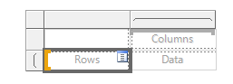

# Dynamic Column selection in paginated reports

This topic outlines how to dynamically select columns from a SQL table and display them in a paginated report.

## Prerequisites
[AdventureWorks sample database](https://docs.microsoft.com/en-us/sql/samples/adventureworks-install-configure?view=sql-server-ver16&tabs=ssms#deploy-to-azure-sql-database)

[Power BI Report Builder](https://docs.microsoft.com/en-us/power-bi/paginated-reports/report-builder-power-bi)


[Visual Studio](https://visualstudio.microsoft.com/) (Optional)

## Database Objects
Once the AdventureWorks sample database has been deployed, the first step is to create a new schema to hold our objects.
``` 
CREATE SCHEMA [dyn] AUTHORIZATION [dbo]
```
Once the schema is created we want to create the stored procedures that will be referenced in our report.

The usp_GetTables procedure generate a list of tables that we would like to query. 
```
CREATE PROCEDURE [dyn].[usp_GetTables] AS 

SELECT 
	QUOTENAME(sc.name) + '.'+ QUOTENAME(t.name) AS [Label]
	,t.object_id AS [Value]
FROM sys.tables t
INNER JOIN sys.schemas sc
ON t.schema_id = sc.schema_id
GROUP BY QUOTENAME(sc.name) + '.'+ QUOTENAME(t.name)
	,t.object_id
ORDER BY QUOTENAME(sc.name) + '.'+ QUOTENAME(t.name)
```
Once we have chosen our table, we will need to select the relevant columns from the table.

```
CREATE PROCEDURE [dyn].[usp_GetColumns] 
	@Object_ID int 
AS

SELECT 
	QUOTENAME(c.name) AS [Label]
	,c.column_id AS [Value]
FROM sys.columns c
WHERE c.object_id = @Object_ID
```
# Building the report

Now that the database objects are in place, we can now create the report.

## Data Source
Open Report Builder and connect to the AdventureWorks database
```
Data Source=xxxxxxx.database.windows.net;Initial Catalog=AdventureWorks
```
## Datasets
Add three datasets to the report using the stored procedures created in the earlier section

| Dataset Name | Stored Procedure |
| --- | ----------- |
| dsData | dyn.usp_GetDynamicColumns |
| dsColumns | dyn.usb_GetColumns |
| dsTables | dyn.usp_GetTables |

## Report Parameters
Once these datasets have been added to the report, three new parameters will be present in the report. These now need to be linked to the relevant datasets.

| Parameter Name | Dataset | Prompt | Value | Label | Allow Multiple Values |
| --- | ----------- | --- | --- | --- | --- |
| Object_ID | dsTables | Select Table | Value | Label | False |
| KeyCol | dsColumns | Select Key Column | Value | Label | False |
| Cols | dsColumns | Select Columns | Value | Label | True |

## Report Body

Now add a matrix to the body of the report.



Select the rows cell, and click the icon and navigate to the following field:

	AdventureWorks -> dsData -> KeyCol

Select the Columns cell, and click the icon and navigate to the following field:

	AdventureWorks -> dsData -> Column

Select the Data cell, and click the icon and navigate to the following field:

	AdventureWorks -> dsData -> Val
	
## Preview the Report

Within Report Builder click the icon to run the report. Select a Table, a Key Column and Columns to be displayed in the report.
