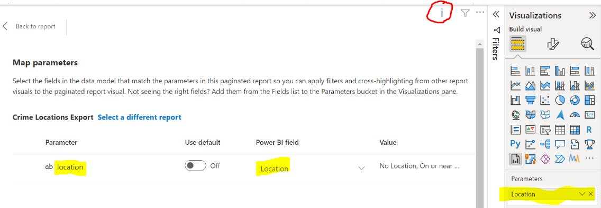

# Paginated Report Visual limits
Further to the limitations detailed at [Paginated Report visual limitations and considerations](https://docs.microsoft.com/en-us/power-bi/visuals/paginated-report-visual#considerations-and-limitations), note that the Parameters data table row count should not exceed 30,000 otherwise the parameter values will be sampled when passed to the visual and lead to an unexpected Paginated Report output. If this happens a blue "i" icon will be displayed on the top right hand side of the visual with the tooltip "Too many values. Not showing all data."

