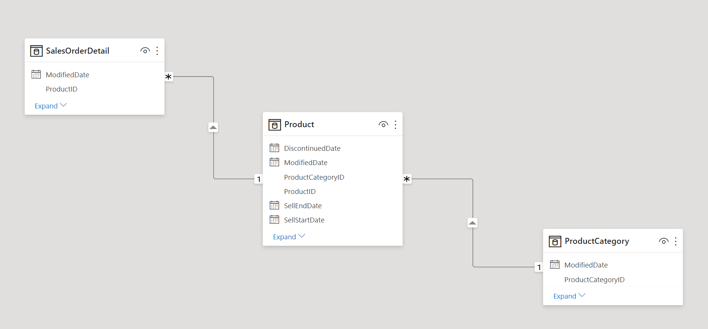
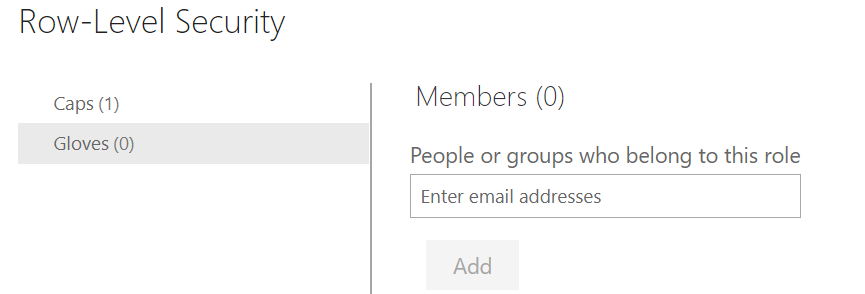
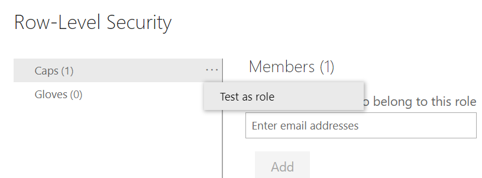
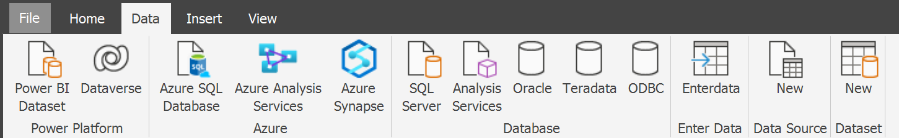
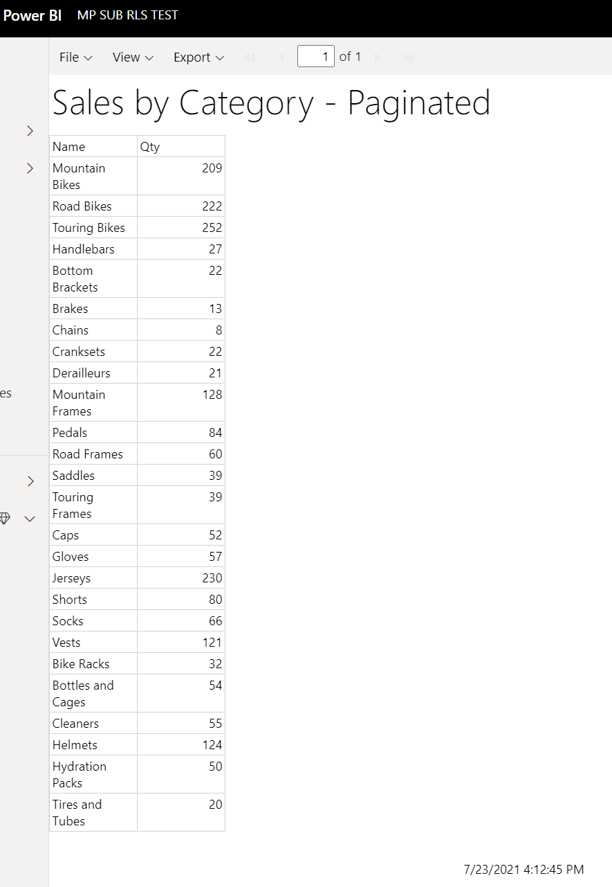

## Limitations of native email subscription 
When you have paginated report on a premium/embedded capacity, you can set up email subscriptions for yourself and other users in your organization. When you set up email subscription, Power BI will send an email with the report as an attachment with a frequency of your choice. You can choose to have the attachment in different format, including Excel, PPT, PDF etc, up to 25MB.
However, currently subscriptions sent to all recipients are with the same attachments, this is because  report attachment reflects the data based on your permissions, and not the recipients'.
This blog covers an alternative approach using power automate, in which you are able to send different attachments to recipients based on their roles set up in Power BI dataset's security model.

## Power BI Dataset

1. Have a Power BI dataset in import or direct query mode. Once published, the datasets should <b>not</b> be configured with the SSO option in order for this to work. For this example, data from the [Adventure Works sample database](https://docs.microsoft.com/en-us/sql/samples/adventureworks-install-configure?view=sql-server-ver15&tabs=ssms) is used. 

2. Create security roles and define a relevant [Row-Level Security(RLS)](https://docs.microsoft.com/en-us/power-bi/admin/service-admin-rls) model. In the example below we have a very simple RLS model, where the product sales are filtered by product category, depending on what role someone is part of. People in the <b>Caps</b> role will only be able to see caps sales, while people in the <b>Gloves</b> role will only be able to see Gloves sales. 

3. Once the dataset is published to the Power BI service, you can add people or groups from your Azure Active Directory to the created roles. 

4. The RLS roles can be tested by the author in Power BI Desktop or the Power BI service, to make sure they behave as intended. 

5. Using [Power BI Report Builder](https://docs.microsoft.com/en-us/power-bi/paginated-reports/report-builder-power-bi), connect to the dataset mentioned above and create a paginated report.

6. Publish the paginated report to a workspace on the Power BI service backed by dedicated capacity. 

## Power Automate set-up

### The Power Automate Approach requires a paginated report being built on top of a Power BI dataset that has security model set up as described in the last section. Additionally, a Power automate is set up in below steps in order to leverage the security model in the underlying Power BI dataset.

1. Create Power Automate Flow from Template!
   Go to flow.Microsoft.com  and in the search bar type in "paginated report", choose the template "Export a Power BI paginated report for each row in an Excel Online table", sign in and continue in the next page. 
   
2. Customize template
   Once in the flow, you can set the recurrence of the subscriptions. The next step is to create a Excel sheet, with a column named "EmailAddress", and list the email addresses of all recipients, format it as a table and give it a table name (e.g. UserTable), and then save the Excel sheet in OneDrive. In the next step "List rows present in a table", take the one drive location for the Excel sheet and use dropdown to pick the table name. 
   

