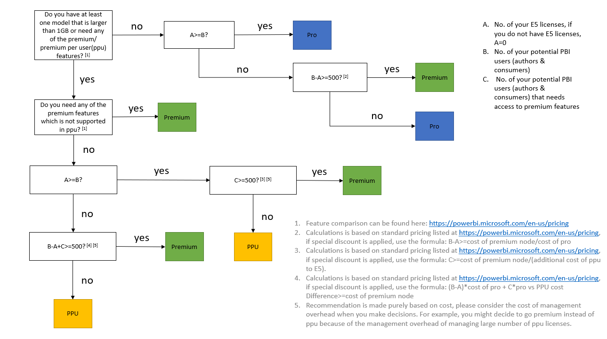

# Pro vs Premium Decision Tree

[Link to Diagram PPT](https://github.com/lipinght/pbideployment/blob/main/ProvsPremium/images/ProvsPremiumDecisionTree.pptx)

## Pro

* Both authors and consumers who access the workspaces will need Pro licenses if workspace is not assigned to a premium capacity.
* Pro is ideal for [Small Team Collaboration](https://github.com/lipinght/pbideployment/blob/main/DeploymentPatterns/DeploymentPatterns.md#small-team-collaboration)
* In the event Pro is been used for [Large Team Collaboration and Distribution](https://github.com/lipinght/pbideployment/blob/main/DeploymentPatterns/DeploymentPatterns.md#large-team-collaboration-and-distribution), be mindful of management overhead on license management. 

## Premium per user (PPU)

* Both authors and consumers who access the workspaces will need PPU licenses if workspace is not assigned to a premium capacity.
* PPU is ideal for [Small Team Collaboration](https://github.com/lipinght/pbideployment/blob/main/DeploymentPatterns/DeploymentPatterns.md#small-team-collaboration) if that small team need some premium features to collaborate on.
* For [Large Team Collaboration and Distribution](https://github.com/lipinght/pbideployment/blob/main/DeploymentPatterns/DeploymentPatterns.md#large-team-collaboration-and-distribution), be mindful of management overhead on license management on ppu license. In case of large teams, it is often better to go for premium capacity due to management overhead.

## Premium                                                                                                                                      

*[Power BI Premium Deployment White Paper](https://docs.microsoft.com/en-us/power-bi/guidance/whitepaper-powerbi-premium-deployment)