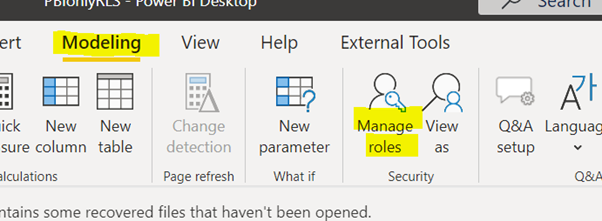
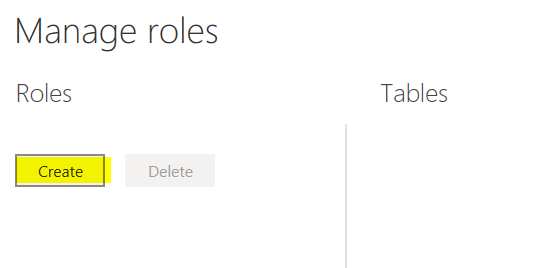
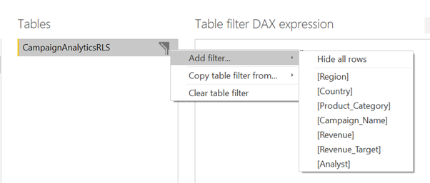
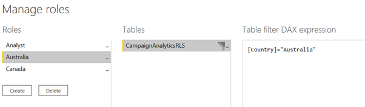
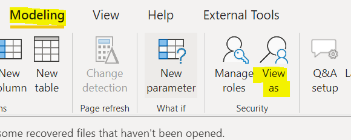
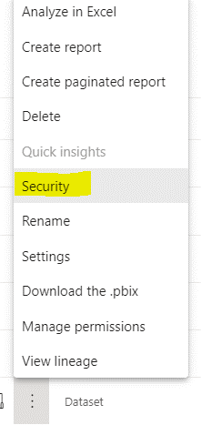
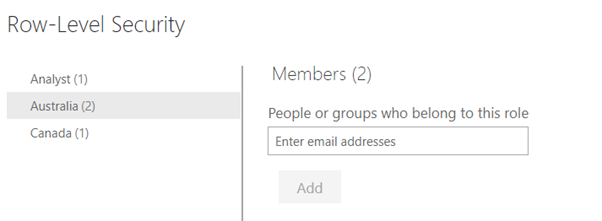

# Row-level Security in Power BI

Row-level security (RLS) in Power BI is used to restrict access to a subset of data at row level for defined user. RLS works for both import mode or DirectQuery mode. Below are the steps to set up RLS in Power BI.

# Tutorial 

1. Load your tables into Power BI, establish relationships between tables as needed.
2.	On the “Modelling” Tab, select “Manage Rols”.

3.	Under roles, click “Create”, give the role a descriptive name.

4.	Choose the table where you want to set up RLS, and in “Table filter DAX expression” box, type in [Column] = ”Value” , you can type the column name directly or click the … next to the table name, select “Apply Filters” and pick the column name.
 
In below example the role “Australia” is set up so that the end users assigned to the role can only see data filtered down to “Australia” by the “country” columns in “CampaignAnalyticsRLS” table.

5.	Click “save”
6.	Test the role by clicking “View as” on the “Modelling” tab

7.	Select the role that you have created and click “ok”

8.	Once testing completes in desktop and you can publish the pbix to power bi service. In order to set up security model in power bi service, click the three dots on the right hand side of dataset and select “security”

9.	You can add end users or groups to the role, and click “add”, for group types supported, please see [here]( https://docs.microsoft.com/en-us/power-bi/admin/service-admin-rls#add-members) 

10.	You can test what data members in the role can see by clicking the “…” next to the role name, and click “test as”

# Consideration

* Row-level security filter uses single-directional filters by default, if you need to enable bi-directional filtering for RLS, you can select the relationship and tick the “Apply security filter in both directions” box. 

* In Power BI Service, RLS does not apply to admin, members, contributors in Power BI workspaces, if you want to set up RLS for end users, make sure they are set  up as Viewer at workspace level. 

# Useful Links

[Row-level security Microsoft Docs](https://docs.microsoft.com/en-us/power-bi/admin/service-admin-rls)
