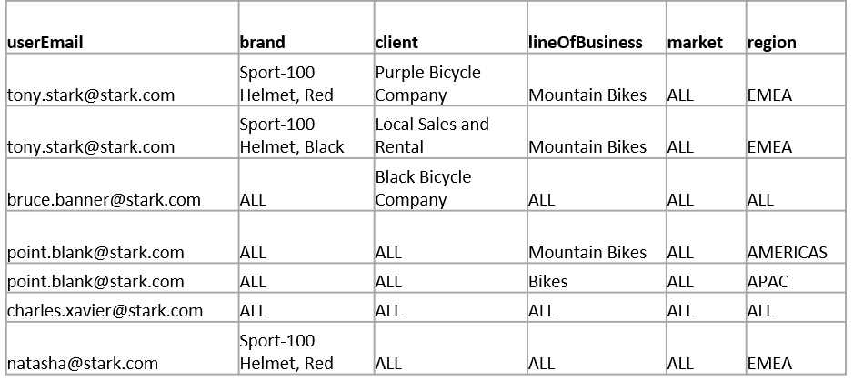
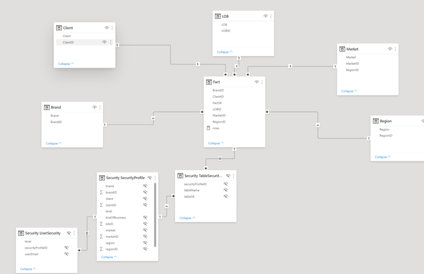
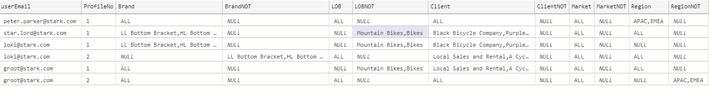
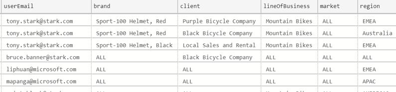
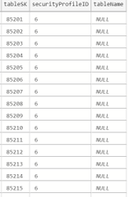
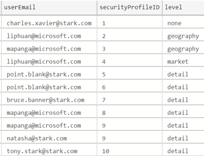
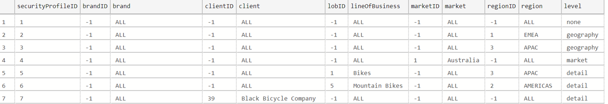
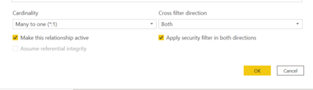
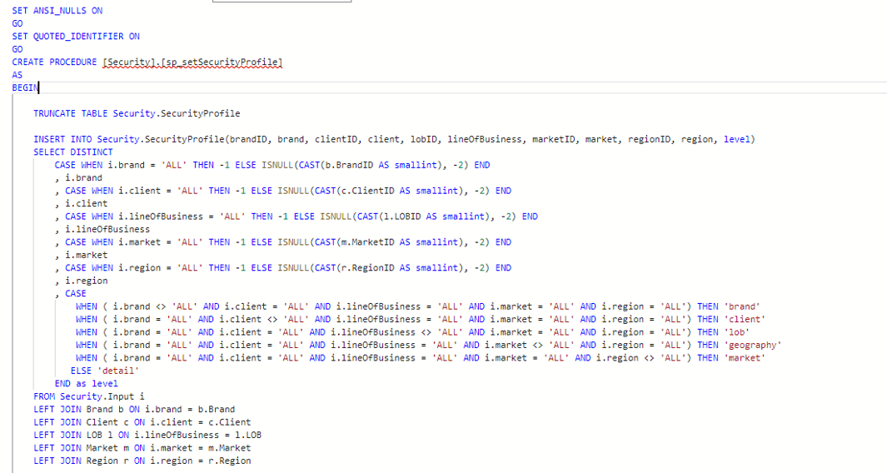
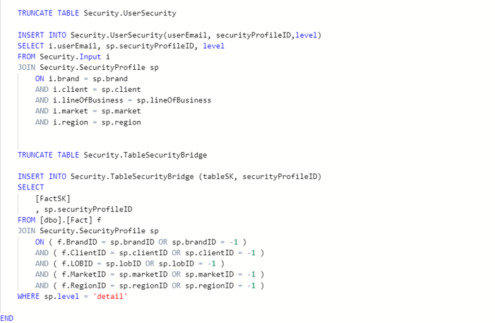

# Complex RLS

## Problem Statement                                                                                                                            

This solution is to address complex security scenario such as the outlined table

 

Tony Stark needs to have access to data that has Line of business = “Mountain Bikes” and Region = “EMEA” and that has
* brand = “Sport-100 Helmet, Red” and Client = “Purple Bicycle Company” 
Or 
* brand = “Sport-100 Helmet, Black” and Client = “Local Sales and Rental” 
Point Blank needs to have access to data that has  
* Line of business = “Mountain Bikes” and Region = “Americas” 
Or 
* Line of business = “Bikes” and Region = “APAC”

Other example users can see the data limited to none/1/2 or more dimension filters  

[Basic](https://github.com/lipinght/PBICookbook/blob/main/RLS/basic.md) RLS set up will not work here because the row context is evaluated seperately in two different tables. If you were to set up two filters in two different tables for a role, in Tony Stark's case, he will be able to see all clients as soon as brand = “Sport-100 Helmet, Red” and all brands as soon as “Purple Bicycle Company”, which does not achieve the above desired outcome.

## Solution Overview

* SecurityProfile table: each combination of values from one or multiple dimensions that is needed in order to enforce to RLS scenario

* UserSecurity table: each user will have access to one or more security profiles. Multiple users can have access to the same security profile

* TableSecurityBridge table: maps what rows in the secured table can be seen by a certain security profile. Only populated for “detail” security roles. “detail” security roles are security roles based on values from multiple dimensions 

* If a certain user would have access to data that is filtered by only one dimension, their RLS will go through dimension table instead in order to maximize performance and decrease the size of the bridge table

 

## Table Setup

* Set up an **userinput** table in the back-end to store security requirement (to be update as needed) and to be used as a source when populating the other metadata tables required for the dynamic security. The userinput table does not need to be included in the Power BI model. userInput Table( for a single profile, between "DimensionName"and "DimensionNameNOT", one and only one column can be populated, and use comma (or other separators) to list all conditions for an attribute in a single cell. Below is  an example.

 

* Set up an **input** table in the back-end (created based on the logic from the userinput table). The input table does not need to be included in the Power BI model.Below is  an example.

 

* Set up the below security tables in back-end (created based on the logic from the input table, Store Procedure Example below) and include them in the Power Bi dataset as hidden tables
| Tables |
|:------:|
| Security Profile |
| Security Bridge |
| User Security |

* **Security Bridge** Table (“tablename” is not used, unless you are using the same bridge table to filter different tables).Below is  an example.

 

* **User Security Table** example

 

* **Security Profile Table** example

 

## Model Setup                                                                                                                                  
* Load 3 security tables into power bi in additional to fact/dim tables
* Set up relationships as per shown in screen, connecting keys:
	* Security Profile ID 
	* TableSD/FactSD
* Pay attention to the 1:* relationships when setting up
* Security bridge and fact table needs to have a bidirectional security filter

 

 

## RLS Setup                                                                                                                                    
* For users that need access to data filtered by 2 or more dimensions

 

* For users that need access to data filtered by 1 dimension (region as example)

 

* Set up AAD groups for each role you will need and in Power BI Service Assigned each role to corresponding AAD group

## Backend Data Processing Recommendation                                                                                                       
* Azure Data Factory (codeless)
* Stored Procedure (SQL)
* Azure Databricks (codefirst)

**Sample Stored Procedures**

  
 
 

## Considerations                                                                                                                               

* The code and ADF mapping data flow used to populate the security tables has not been optimized for performance or readability an is provided solely as reference to understand the logic behind the security tables
* The bridge table should be kept as small as possible to avoid a significant increase in the size of the dataset or the performance of the model. Security profiles should be evaluated so that they are not too large.
* If your dimensions have a hierarchical relationship (e.g. Region and Market), consider using a snowflake structure and reduce the dimensions that need standalone RLS setup
* If you have a single user that needs to be part of both detailed level (two or more dimensions)and higher level (one dimension), i.e. can see everything from LOB= “Accessories” and Client =“Active Systems” but also see everything from Region =“APAC”, the current model will not work due to the bi-directional security filter between the fact table and the bridge table. One potential workaround is to have one dataset for the detail security model and another for the single dimension roles

## Benchmark Test                                                                                                                               
* Dataset Size
	* Dimension table sizes are 
		* 437 for clients
		* 295 for brand
		* 41 for LOB
		* 100 markets
		* 3 Regions
	* Fact Tables Size 52 Millions rows
	* Security Bridge Table 781K rows
	* Security profile 12 

* Performance (Import Mode)
	* Desktop
		* Higher level (1 dimension ) 600 ms
		* Detail level (2 dimensions) 1.8 seconds
	* Power BI Service 
		* Higher level (1 dimension ) < 2s
		* Detail level (2 dimensions) < 3s

