# Using Service Principal to Authenticate Against Power BI Service

Service Principal is an authentication method to gain access to Power BI Service Content and APIs. It is a great way to authenticate against Power BI when doing programatic development of Power BI content. A few examples of its usage are listed below:

* [Embed Power BI content in Applications](https://github.com/lipinght/pbideployment/blob/main/Embedded/EmbeddedOverview.md)
* [Automation of data refresh using XMLA endpoint](https://github.com/mariuspc/pbi-xmla-refresh)
* [Using Purview to scan Power BI tenant (Managed Identity)](https://github.com/lipinght/PBICookbook/tree/main/PurviewforPBI)

This tutorial walks through how to set Service Principle up in order to gain access to Power BI service.

Step 1: Create App Registration (Not Needed for Purview Scan)

1. In [Azure Portal](https://portal.azure.com/), search for **Azure Active Directory** and click on it.

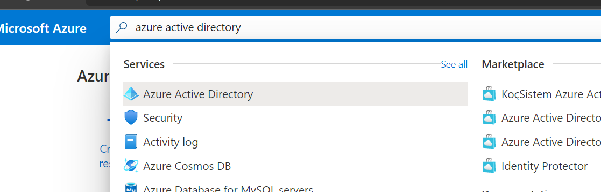

2. On the left hand side navigation, find **App Registration** under **Manage** and click on it.

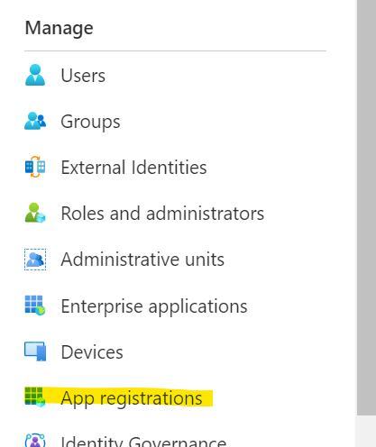

3. Click **New registration**, give it a name, select **Supported account types**, and optionally give it **Redirect URI** if needed and then click **Register**.

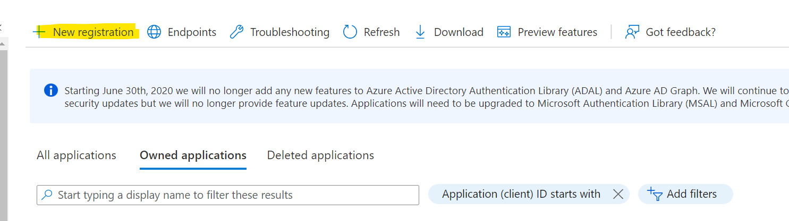

4. Once registered, in the **Overview** page, you will see the application(client)ID, copy and save it, as it will be used when you are authenticating against Power BI.

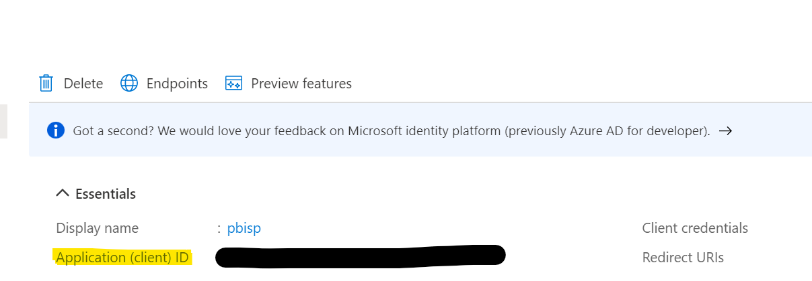

5. On the left hand side navigation, find **Certificates & Serects** under **Manage** and click on it.

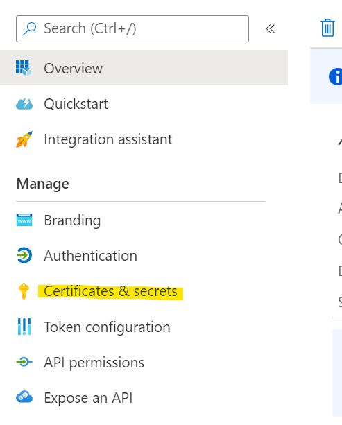

6. Click on **New Client Secrect**, give it a description and expiration period, click **add**. Copy and save the secrect **value** as you will not see it again. It will be used when you are authenticating against Power BI.

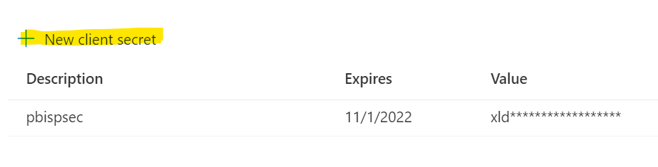

Step 2: Create Security Group

1. In [Azure Portal](https://portal.azure.com/), search for **Azure Active Directory** and click on it.

2. On the left hand side navigation, find **Groups** under **Manage** and click on it.

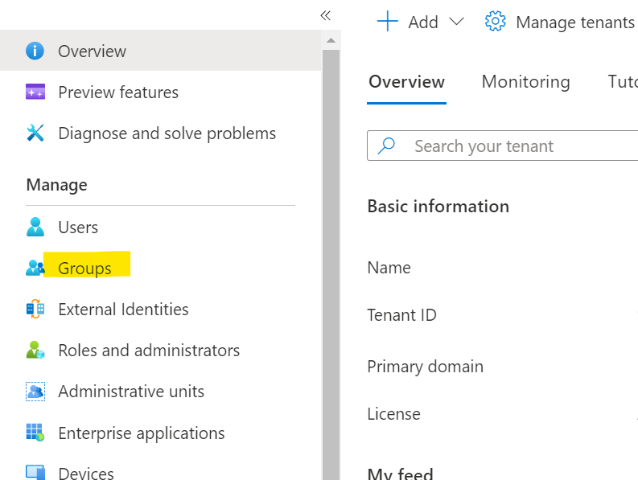

3. Click **New group**, for **Group Type**, choose "Security", give the group a name, click on **No members selected**, type in the name of the app you created in Step1 (type in Purview's managed identity if you are doing the set up for purview scan), click **select** and click **create**.  

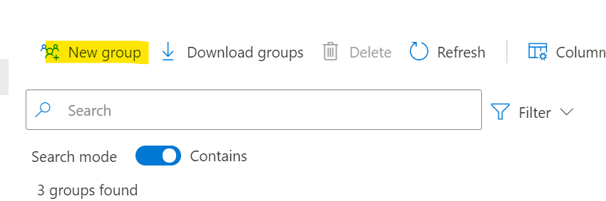

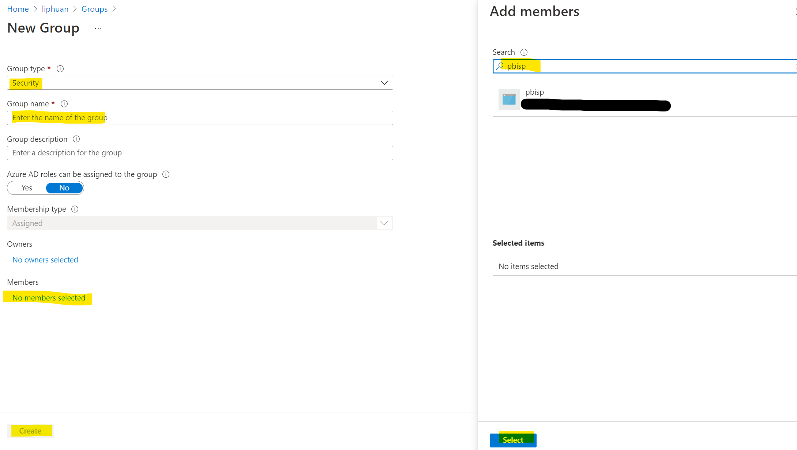

Step 3: Enable Service Principal in Power BI Tenant Setting

1. Go to [admin portal](https://app.powerbi.com/admin-portal/tenantSettings) in Power BI ( you have to have Power BI Admin rights in order to do this step). 

A. If you are doing embedded or XMLA endpoint, go to under Developer settings, find **Allow service principals to use Power BI APIs**, toggle on "Enabled" and in **Apply to:**, Choose **Specific security groups (Recommended)** and type in the security group name you just created, click **Apply**

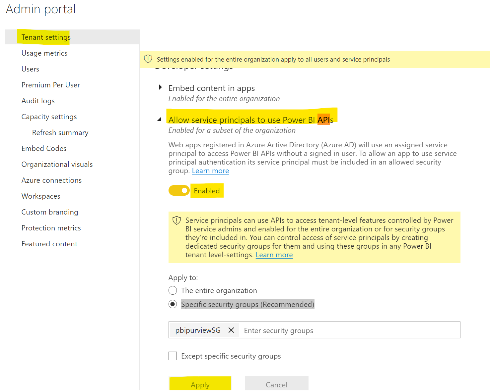

B. If you are doing Purview Scan, go to under Admin API settings, find **Allow service principals to use read-only Power BI admin APIs**, toggle on "Enabled" and in **Apply to:**, Choose **Specific security groups (Recommended)** and type in the security group name you just created, click **Apply**. Do the same for **Enhance admin APIs responses with detailed metadata**

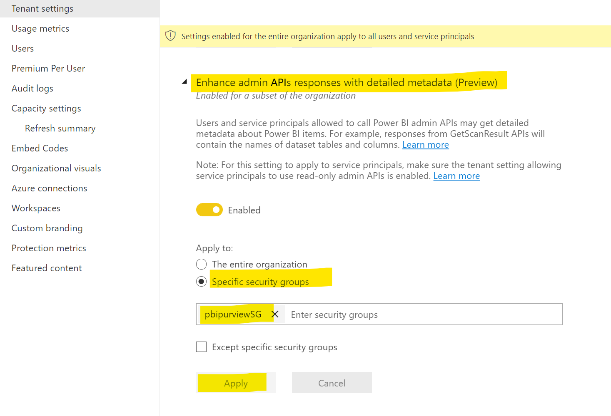

**Note**: Once added, it takes 15 mins for the admin setting to take effect.

Step 4: Add Service Principle to the workspace (Not Needed for Purview Scan)

1. In the Workspace, click on **Access** on the right,

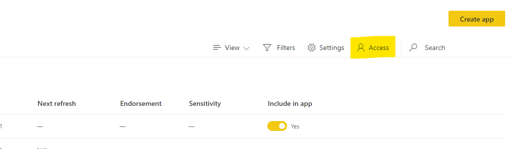

2. Type in the name of the app created in Step 1 or the Name of the security group created in Step 2, select either **member** or **admin**, click **add**

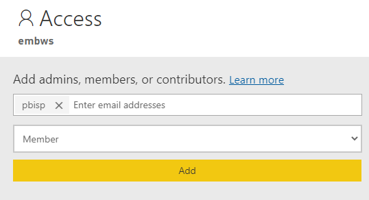

Step 5: Enabled XMLA Read-Write (Only needed for XMLA use case)

1. go to [capacity admin in admin portal](https://app.powerbi.com/admin-portal/capacities) (you will need capacity admin right to do this), click into the capacity your workspace is residing in. under **workloads**, choose **read write** for XMLA endpoint, click **Apply**

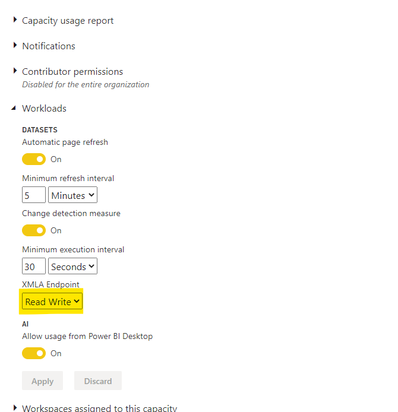

## Next Steps
* For embedded, use the client ID and secrect that you created in step 1 in your application code to authenticate to access Power BI API, example in [Embedded](https://github.com/lipinght/pbideployment/blob/main/Embedded/EmbeddedOverview.md)

* For [XMLA endpoint](https://github.com/mariuspc/pbi-xmla-refresh), use the client ID and secrect that you created in step 1 in automation to authenticate against Power BI Service.

* For Purview, please see [here](https://docs.microsoft.com/en-us/azure/purview/register-scan-power-bi-tenant#steps-to-register-in-the-same-tenant) for instruction on how to register Power BI as a data source in Purview and [here](https://docs.microsoft.com/en-us/azure/purview/register-scan-power-bi-tenant#scan) for how to scan Power BI in Purview. 
